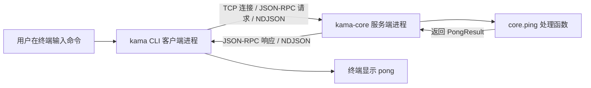

## 0. 先用一分钟建立全局认知

当我们运行：

```bash
uv run kama-core
```

实际上启动了一个**等待别人向它发送命令的 Python 程序**。然后在另一个终端运行：

```bash
uv run kama ping
```

第二个程序会向第一个程序发一个消息：“你还在吗？”前者回一个包含版本号、已运行时长和收到消息的时间的结果。终端打印大致如下（数值只是示意）：

```text
pong server=0.0.1 uptime=12500ms latency=3ms
```

这一来一回，就是 S0 的验收目标。注意：**S0 尚未接入真正的 LLM 推理、工具调用和 Agent Loop**；TUI 入口也还是占位实现。我们现在学习的是未来 Agent 的“基础设施”。



> [!important] 把一条链拆成五个问题
> 1. **谁在说话？** CLI 与 Core：两个进程。  
> 2. **从哪里说？** 本机 `127.0.0.1:7437`：TCP loopback。  
> 3. **怎么知道一句话讲完了？** NDJSON：每条 JSON 以换行结束。  
> 4. **一句话表达什么？** JSON-RPC：指定方法、参数、请求 ID、成功或错误。  
> 5. **由谁完成动作？** Core 的 handler：收到 `core.ping` 后生成结果。

---

## 1. 先补操作系统基础：程序、进程、线程、客户端、服务端

### 1.1 程序不等于进程

- **程序（program）**：磁盘上的代码，例如 `app.py`。它还没有运行。
- **进程（process）**：操作系统正在执行的一个程序实例。它有自己的进程 ID（PID）、内存空间、打开的文件、网络连接等资源。
- **线程（thread）**：进程内部的执行单元。同一进程里的线程通常共享进程内存。
- **协程（coroutine）**：由程序调度、能在等待时主动让出控制权的一种执行结构。在 Python `asyncio` 中，多个协程通常可以在一个线程的事件循环里协作运行。

最简类比：**程序是菜谱，进程是正在按菜谱做菜的厨房，线程是厨房里的厨师，协程是一个厨师在等水烧开时切菜**。类比有局限，但能先分清层次。

运行两次 `python some_file.py`，通常得到两个不同的进程。即使它们执行同一份代码，也各有自己的运行状态。

### 1.2 为什么 KamaClaude 不把所有内容写进一个进程？

单进程原型完全可以这么写：

```python
# 仅为教学的单进程示例，不是项目源码
def ping():
    return "pong"

print(ping())
```

这种写法非常适合初学者，却无法体现真实 Agent 运行时的边界。在后续阶段，一个 Agent 可能运行很久、不断调用工具、等待权限审批、产生事件；界面却可能被用户关闭、重开、替换成另一种界面。

KamaClaude 因此把角色拆开：

| 角色     | 实际程序                     | 核心责任              | 可以怎么理解   |
| ------ | ------------------------ | ----------------- | -------- |
| 客户端    | `kama`（CLI）              | 接收终端命令、构造请求、展示结果  | 前台接待员    |
| 服务端    | `kama-core`（Core daemon） | 监听请求、验证与分发、执行后端逻辑 | 后台工作中心   |
| 未来的客户端 | `kama-tui`               | 更丰富的终端交互界面        | 带面板的接待窗口 |

这样拆分的长期意义：

1. **关注点分离**：前端负责输入和展示，Core 负责执行。
2. **生命周期解耦**：CLI 执行完可以退出；Core 可以继续运行。未来 TUI 退出不必等于任务退出，但是否真正能续跑还取决于后续阶段的任务管理实现。
3. **多客户端扩展**：以后 CLI、TUI、Web 可以通过统一协议与 Core 交流。
4. **可测试性**：我们能像外部程序一样测试 Core 的公开接口，而不只是直接调用它的内部函数。
5. **隔离与可观测性**：进程边界迫使我们明确传什么消息、怎么报错、在哪里记录日志。

代价也真实存在：代码更多，需要端口管理、协议设计、错误处理；两边的 Python 对象不能像本地函数参数那样直接互相传递。**拆成两个进程是有意识的架构取舍，不是所有小型 Agent 都必须这样做。**

### 1.3 CLI 是什么？TUI 是什么？

**CLI（Command-Line Interface，命令行界面）**：用户通过命令和参数操作程序，例如 `kama ping`。`kama` 是可执行命令名称，`ping` 是它识别的子命令。

**TUI（Terminal User Interface，终端图形化界面）**：仍运行在终端里，但可以包含面板、滚动列表、快捷键、实时状态等。它不同于桌面窗口式 GUI，也不同于普通的一行行命令式 CLI。

S0 虽然在安装配置中已经声明了 `kama-tui`，但它只打印 `tui not implemented yet (S2)`；此时的学习重点应放在 CLI 与 Core。

### 1.4 daemon（守护进程）到底是什么？

Daemon 通常指**长期运行、持续提供服务、并非每执行一条命令就自动退出**的后台服务进程。这里的 `kama-core` 就是这种角色：启动后绑定地址并持续等待客户端。

但要特别区分：

- `uv run kama-core`：**前台**运行服务，当前终端被占用，按 `Ctrl+C` 可退出。
- `uv run kama-core &`：让 shell 将它作为**后台作业**运行。
- 真正由 `systemd`、`launchd` 等管理的系统服务，还涉及自动启动、崩溃重启、日志管理等；**S0 没有因为名字带 daemon 就自动拥有这些功能**。

换句话说：*daemon 是服务角色/生命周期描述，不等于一启动就自动“隐藏到后台”。*

---

## 2. 两个进程怎样交流：从 IPC 到 TCP loopback

### 2.1 IPC 是什么？

**IPC = Inter-Process Communication（进程间通信）**。两个进程拥有各自的内存，通常不能直接拿到对方的 Python 变量，所以需要操作系统提供的通信机制。常见方案包括：

| IPC 方式             | 直观理解               | 典型用途          |
| ------------------ | ------------------ | ------------- |
| 管道 pipe            | 两个程序通过字节通道传数据      | shell 命令之间传文本 |
| Unix domain socket | 本机进程之间建立 socket 连接 | 许多本地服务        |
| TCP socket         | 通过 IP 地址和端口建立字节流连接 | 本机服务、跨机器服务    |
| 共享内存               | 多进程直接访问一块约定的内存     | 高性能数据共享，需要同步  |
| 消息队列               | 先把消息交给队列，再由另一端接收   | 解耦、异步任务处理     |

KamaClaude S0 选择 **TCP socket**。虽然程序都在同一台机器，这依然属于 IPC。不同方案各有适用场景，并不是 TCP 唯一正确。

### 2.2 TCP、IP、地址、端口、socket 分别是什么？

- **IP 地址**：帮助定位网络接口。例如 `127.0.0.1` 表示本机 IPv4 回环地址。
- **端口（port）**：同一台机器上区分不同网络服务的数字。`7437` 是项目默认端口，**不是 Python 或 TCP 规定的特殊端口**。
- **TCP**：提供有序、可靠的**字节流**传输。TCP 管理连接与字节的传送，并不理解 JSON。
- **Socket**：应用程序通过操作系统使用网络连接的接口/对象；可以理解为程序和 TCP 之间的“插座”。
- **监听（listen）**：服务端把自己绑定到地址、端口，等待客户端发起连接；不是“监听麦克风”，而是在网络接口上接受连接请求。

`127.0.0.1:7437` 的含义是：

```text
127.0.0.1           :7437
  │                   │
  └─ 本机回环 IP      └─ 这个服务使用的端口
```

### 2.3 什么叫 TCP loopback？

**Loopback（回环）** 意味着数据发往 **同一台计算机**，不需要真的发到外部网络中的另一台设备。CLI 和 Core 即使在同一台电脑上，也可以按正常 TCP 客户端/服务端方式连接。

```text
┌───────────────────── 同一台电脑 ─────────────────────┐
│                                                     │
│   kama CLI  ─── TCP 连接 ───▶ 127.0.0.1:7437         │
│                         ▲                           │
│                         │                           │
│                    kama-core 监听                   │
└─────────────────────────────────────────────────────┘
```

为什么不用 HTTP？因为 HTTP 也是应用层通信协议，S0 选择了**直接在 TCP 字节流上传 NDJSON + JSON-RPC**，不需要再引入 HTTP 请求头、URL、HTTP 状态码这一层。**使用 TCP 不代表在使用 HTTP；使用 JSON-RPC 也不意味着必须走 HTTP。**

> [!warning] 安全边界
> 绑定 `127.0.0.1` 主要限制远程网络主机直接连接；**它不代表本机任意其他进程都不可连接**。S0 的本地 TCP 接口也不是因为使用 loopback 就自带身份认证。初学阶段保持默认 host，**不要随手改成 `0.0.0.0` 对外监听**。

### 2.4 TCP 并不会替你划分消息

这是通信里最值得记住的一点：**TCP 是字节流，不是“一次发送 = 一次接收”的消息队列。**

例如发送两次：

```text
发送 A: hello
发送 B: world
```

接收端可能分几次读到 `hell`、`oworld`，也可能一次读到 `helloworld`。TCP 保证字节顺序，却**不保证应用消息边界**。因此我们必须约定：消息在哪里结束？这就是下面的 NDJSON。

---

## 3. NDJSON：告诉接收端“这一条消息到此结束”

### 3.1 JSON 先是什么？

JSON 是一种**把结构化数据写成文本**的格式。例如：

```json
{"name":"kama","online":true,"version":1}
```

它不等于 Python 的字典：Python 字典可以通过 `json.dumps()` 转成 JSON 文本，再经 UTF-8 编码成字节写入 socket；对方再把字节解码/解析回来。

### 3.2 NDJSON 是什么？

**NDJSON = Newline Delimited JSON**，按行分隔的 JSON。每一个完整 JSON 值独占一行，**用换行符 `\n` 标记结束**。

例如 TCP 中传输的内容实际像这样：

```text
{"method":"core.ping","id":"a"}\n
{"method":"core.ping","id":"b"}\n
```

上面的 `\n` 是为了看清而写出的转义表示；实际发送的是**换行字节**。真实数据里，两条消息分别是一整行，而不是把 JSON 美化排成多行。

S0 对应的发送逻辑可以简化为：

```python
writer.write((json.dumps(request) + "\n").encode("utf-8"))
await writer.drain()
```

接收逻辑：

```python
line = await reader.readline()  # 一直等到出现换行或连接结束
request = json.loads(line)
```

### 3.3 为什么称为“帧”（frame）？

**帧在这里泛指应用层分出来的一条完整消息**。它不是以太网中的链路层 frame，也不是视频的一帧。

- TCP 负责传一串字节。
- NDJSON 通过换行界定一条条消息（分帧）。
- JSON 让每条消息具有结构。

假如不加 `\n`，对方的 `reader.readline()` 可能持续等待；即使字节已经送达，也不能把它当成一条完整的 NDJSON 消息。这个现象是非常适合亲自实验的。

### 3.4 NDJSON 的优缺点

优点：简单、好调试；人可以直接看；流式处理方便；一条一条解析。缺点：必须严格处理换行、编码、消息大小、非法 JSON；不适合原样承载含换行的未转义 JSON 文本；若要传大量二进制数据通常需另作设计。

S0 服务端给读取行设置了约 **1 MiB** 的限制，防止客户端随意发送超长单条消息。这是基础的资源保护，而不是完整的网络安全方案。

---

## 4. JSON-RPC：让消息表达“调用哪个功能”

### 4.1 为什么已经有 JSON 和 NDJSON，还要 JSON-RPC？

JSON 仅规定数据长什么样；NDJSON 仅规定数据怎么分条。我们还缺一套规则：

- 发送方究竟想调用什么功能？
- 参数放在哪里？
- 结果如何对应原先的请求？
- 失败怎么表示？

**RPC（Remote Procedure Call）** 就是让调用方像“请求远处的一项函数服务”那样，通过通信去调用另一进程的操作。这里的“remote”也可以只是另一**本机进程**。

**JSON-RPC 2.0** 为请求、成功和失败规定了格式。它与 TCP/NDJSON 是不同层次。

### 4.2 一条 `ping` 请求长什么样？

以下排成多行便于阅读；**真正的 NDJSON 传输时要压成单行，再加 `\n`**。

```json
{
  "jsonrpc": "2.0",
  "id": "cli-1",
  "method": "core.ping",
  "params": {
    "client": "cli/0.0.1"
  }
}
```

| 字段 | 是什么意思 |
|---|---|
| `jsonrpc` | 告诉对方使用 JSON-RPC 2.0 格式 |
| `id` | 本次请求的标识；回应时回传，用于匹配请求和响应 |
| `method` | 让服务端执行哪项操作，这里为 `core.ping` |
| `params` | 这项操作所需要的输入参数 |
| `client` | 在 `params` 里声明调用者的名字/版本，不是 TCP 必备字段 |

服务端成功返回：

```json
{
  "jsonrpc": "2.0",
  "id": "cli-1",
  "result": {
    "server_version": "0.0.1",
    "uptime_ms": 12500,
    "received_at": "2026-05-11T07:31:14.022Z"
  }
}
```

这个 `received_at` 时间只是结构示例，不代表现在的时间。注意请求的 `id` 和响应的 `id` 相同；**响应的 `result` 是业务操作真正给出的数据**。

失败时则使用 `error` 而不是 `result`：

```json
{
  "jsonrpc": "2.0",
  "id": "cli-1",
  "error": {
    "code": -32601,
    "message": "Method not found: missing.method",
    "data": null
  }
}
```

### 4.3 Ping 和 PongResult 具体意味着什么？

- **ping**：测试对方是否能够接收并处理请求的“探测命令”，类似“喂，在吗”。本项目中对应 `core.ping`。
- **pong**：对 ping 的回应，类似“在”。
- **PongResult**：项目定义的 Python 数据模型，包含 `server_version`、`uptime_ms`、`received_at` 三个字段。它不是 TCP 自带的特殊消息。
- **`latency=...ms`**：CLI 在本地用单调时钟测得的发起连接、收发并解析前这一段往返耗时（具体计时到读取响应行后）；不是单纯的“网络线路耗时”。
- **`uptime=...ms`**：Core 进程本次启动后经过的时长，不是本次 ping 耗时。

这里的 ping 是**项目自定义应用层 RPC 方法**，不要和命令行里检查 ICMP 连通性的系统命令 `ping 127.0.0.1` 混为一谈。

### 4.4 为什么要有错误码？

| 错误码 | 含义 | 例子 |
|---|---|---|
| `-32700` | JSON 无法解析 | `{broken json` |
| `-32600` | 请求对象不合法 | 必需的 `id` 或 `method` 缺失（本项目的请求模型要求 `id`） |
| `-32601` | 方法不存在 | 请求一个未注册的方法 |
| `-32602` | 参数无效 | 某个方法的业务参数不符合约定 |
| `-32603` | 处理器内部异常 | handler 抛出意料外的异常 |

**S0 源码细节**：协议文档列出了 `-32602`，但目前 `SocketServer` 在捕获 handler 的 `ValidationError` 时实际回的是 `INVALID_REQUEST(-32600)`；而 `core.ping` 的 handler 直接对 `params` 使用 `.get()`，没有实例化 `PingCommand` 做严格参数校验。这说明**模型文档中的契约与运行时所有细节尚非完全一致**。学习时要分清“协议理想规则”和“当前代码实际检查了什么”。

> [!note] 标准与实现并不完全相同
> JSON-RPC 2.0 标准一般允许字符串/数字的请求 ID，也支持无需应答的 notification 和批量请求；**S0 定义的请求模型目前仅接受字符串 `id`，且没有实现完整的 notification/batch 行为**。这是项目当前范围的设计限制，不是 JSON-RPC 标准本身只允许这些。

---

## 5. 从入口到结果：S0 真实源码逐步走一遍

以下路径都相对于仓库根目录，且对应 `stage/s0` 分支。

### 5.1 先认项目地图

```text
KamaClaude/
├─ pyproject.toml                       # 安装/依赖/可执行命令入口
├─ .env.example                         # 环境变量模板
├─ RUNBOOK.md                           # 如何运行与排障
├─ WIRE_PROTOCOL.md                     # 自动生成的通信协议文档
├─ scripts/gen_protocol_doc.py          # 协议文档生成器
├─ src/kama_claude/
│  ├─ __init__.py                        # 版本号
│  ├─ cli/
│  │  ├─ main.py                        # kama 命令入口
│  │  └─ commands/
│  │     ├─ ping.py                      # 发起 RPC 的客户端
│  │     └─ version.py                   # 输出版本
│  ├─ core/
│  │  ├─ __main__.py                    # python -m 入口
│  │  ├─ app.py                         # CoreApp + 注册 ping handler
│  │  ├─ config.py                      # 运行时配置合并
│  │  ├─ logging_setup.py               # 日志初始化
│  │  ├─ bus/
│  │  │  ├─ envelope.py                 # JSON-RPC 通用外壳
│  │  │  ├─ commands.py                 # PingCommand / PongResult
│  │  │  └─ events.py                   # CoreStartedEvent 类型
│  │  └─ transport/
│  │     └─ socket_server.py            # TCP 监听、读取、分发、响应
│  └─ tui/__main__.py                   # S0 阶段 TUI 占位入口
└─ tests/                               # 单元/集成测试
```

### 5.2 第一步：启动 `kama-core`

`pyproject.toml` 声明：

```toml
[project.scripts]
kama-core = "kama_claude.core.app:run"
```

意味着安装项目后，运行 `kama-core` 会调用 `kama_claude/core/app.py` 里的 `run()`。核心逻辑大致如下（教学压缩版）：

```python
def run():
    asyncio.run(CoreApp().run())

class CoreApp:
    async def run(self):
        config = get_config()
        setup_logging(config)
        server = SocketServer(config.host, config.port)
        server.register("core.ping", self._ping_handler)
        await server.start()
        # 然后等待退出信号，退出时关闭服务器
```

按时间顺序是：**读取配置 → 初始化日志 → 创建服务端 → 注册处理方法 → 开始监听 → 等待退出信号**。这里 `register` 就像通讯录，告诉服务器收到 `core.ping` 时该调用哪个函数。

### 5.3 第二步：启动 `kama ping`

同样，`pyproject.toml` 声明：

```toml
kama = "kama_claude.cli.main:main"
```

CLI 使用 `argparse` 解析用户输入：

```text
kama ping
│    └── 子命令 ping
└─────── CLI 程序入口
```

`cli/main.py` 解析参数后：如果是 `ping`，先调用 `get_config()`，再调用 `setup_logging(config)`，然后调用 `cmd_ping(config)`。因此 CLI 必须知道和服务端一致的 host/port。

**精确例外**：`kama --version` 走的是直接打印版本号的分支，**不需要先读取 Core 的运行配置，也不必连接守护进程**。不能笼统说“一切 CLI 命令都先读取配置”。

### 5.4 第三步：客户端建立连接、发送请求

在 `cli/commands/ping.py` 中，最关键的几行是：

```python
reader, writer = await asyncio.open_connection(config.host, config.port)
writer.write((json.dumps(req) + "\n").encode())
await writer.drain()
line = await asyncio.wait_for(reader.readline(), timeout=10.0)
```

逐句读：

1. `open_connection()`：连接到 Core 的 host/port，得到读取端 `reader`、写入端 `writer`。
2. `json.dumps(req)`：把字典变成 JSON 文本。
3. `+ "\n"`：加上 NDJSON 结束符。
4. `.encode()`：把文本变成可传输的字节。
5. `writer.write(...)`：放进写缓冲区。
6. `await writer.drain()`：让缓冲区有机会排空，必要时等待写入进展；**不是保证服务端已经处理完**。
7. `await reader.readline()`：等服务端回送一整行。
8. `asyncio.wait_for(..., timeout=10.0)`：最多等待约 10 秒，否则抛超时异常。

### 5.5 第四步：服务端收包、解释并分发

`SocketServer` 使用：

```python
self._server = await asyncio.start_server(
    self._handle_connection,
    host=self._host,
    port=self._port,
    limit=_MAX_LINE_BYTES,
)
```

`start_server()` 帮服务器建立**监听 socket**。新的客户端连上来后，框架给 `_handle_connection(reader, writer)` 一对流对象。

一个连接内，服务端重复做以下事情：

```text
readline() 读取一行
    ↓
json.loads() 解析 JSON
    ↓
JsonRpcRequest.model_validate() 校验通用外壳
    ↓
根据 req.method 从 handlers 字典找处理函数
    ↓
await handler(req.params)
    ↓
将结果封装成 JsonRpcSuccess
    ↓
序列化为一行 JSON，加换行，写回客户端
```

如果 JSON 损坏、请求格式错误、方法不存在、处理器抛异常，服务器尝试返回结构化错误。当前 `SocketServer` 还会先探测端口上是否已有服务；成功连接到已有监听者时拒绝重复启动。

### 5.6 第五步：具体的 `core.ping` 做了什么？

`CoreApp._ping_handler()` 大致：

```python
async def _ping_handler(self, params):
    return PongResult(
        server_version=kama_claude.__version__,
        uptime_ms=int((time.monotonic() - self._start_time) * 1000),
        received_at=datetime.datetime.now(datetime.UTC).isoformat(),
    )
```

- `__version__`：软件版本。
- `time.monotonic()`：适合测量经过的时间，不会因系统墙上时钟调整而直接跳变。
- `datetime.now(UTC)`：记录收到请求附近的 UTC 时间。
- `PongResult(...)`：构造一个**有明确字段类型的对象**，之后会被序列化成 JSON。

### 5.7 第六步：客户端收到结果并打印

客户端先解析 JSON，然后判断：

- 有 `error`：按 `JsonRpcError` 校验并向 stderr 输出错误。
- 否则：按 `JsonRpcSuccess` 校验通用外壳，再将 `resp.result` 校验为 `PongResult`。

最后输出 `pong server=... uptime=... latency=...`，关闭连接，CLI 进程退出；Core 仍然等待下一位客户端。

**从头到尾你只调用过本机进程，没有调用远端 LLM API。**

---

## 6. 三层分离：Transport、Protocol/Bus、Business Handler

以后读复杂 Agent 项目，最容易乱的是“所有处理都叫通信”。建议严格拆成三层：

| 层次                | 对应代码                                        | 负责什么                   | 不应该负责什么          |
| ----------------- | ------------------------------------------- | ---------------------- | ---------------- |
| **传输层 Transport** | `transport/socket_server.py`                | 建 TCP 连接、读字节/按行切包、写回字节 | 决定 Agent 怎样规划任务  |
| **协议层 Bus**       | `bus/envelope.py`、`commands.py`、`events.py` | 规定请求/响应/事件的字段、类型、校验规则  | 直接访问终端界面         |
| **业务层 Handler**   | `core/app.py` 中 `_ping_handler()`           | 执行 `core.ping` 真正代表的行为 | 自己处理底层 TCP 粘连/分帧 |

现在可以理解为什么会有两个与 JSON 有关的概念：

- `JsonRpcRequest` / `JsonRpcSuccess` 是**外壳（envelope）**：像快递单，写“送给谁、订单号多少、成功还是出错”。
- `PingCommand` / `PongResult` 是**业务内容（payload/schema）**：包裹里究竟装的是什么类型的数据。

例如一个快递的收件信息是 `method=core.ping`、`id=cli-1`；里面的内容是 `params={"client":"cli/0.0.1"}`。响应同样带 `id`，里面的 `result` 是 PongResult。

### 6.1 Pydantic 是什么？

Pydantic 是 Python 的数据建模和校验库。比如：

```python
from pydantic import BaseModel

class PongResult(BaseModel):
    server_version: str
    uptime_ms: int
    received_at: str

pong = PongResult(server_version="0.0.1", uptime_ms=50, received_at="...")
print(pong.model_dump())       # Python 字典
print(pong.model_dump_json())  # JSON 文本
```

与到处散落随意的 `dict` 相比，明确模型可以更早发现字段拼错、类型错误，也能生成 JSON Schema。

### 6.2 `type` 与 `method` 是一回事吗？

**不是完全一回事。** `method="core.ping"` 是 JSON-RPC 外壳上用来选择服务端处理函数的字段；`PingCommand.type="core.ping"` 是业务模型上用来区分命令类型的字段。它们可以采用相同的字符串，但位于**不同数据结构层**。S0 的线协议示例在 `params` 中并不额外包含 `type`。

### 6.3 Event 是什么？它已经实现了吗？

Command 通常是“请你做某事”；Event 通常是“某事已经发生”。

```text
Command: core.ping              → 请回应我
Result : PongResult             → 本次请求的结果
Event  : core.started           → Core 已启动这件事
```

S0 在 `events.py` 定义了 `CoreStartedEvent` 模型，并在协议文档中列出；但当前 `CoreApp.run()` 并没有把这个事件作为可供客户端订阅的事件流向外推送。**定义事件类型不等于完成 EventBus/事件订阅实现**，这些在后续阶段才逐步展开。

---

## 7. 异步网络与 I/O 模型：为什么代码里全是 `async` 和 `await`？

### 7.1 I/O 是什么？

**I/O = Input/Output（输入/输出）**。在这个项目里，主要指：

- 等待网络连接；
- 接收 TCP 数据；
- 发送 TCP 数据；
- 读配置文件、写日志等。

程序在网络读写时，常常要等待操作系统或对方程序。**等待很久，不代表 CPU 一直在做复杂计算**。

### 7.2 同步/异步与阻塞/非阻塞怎么区分？

这两组词经常被混用，先抓住不同问题：

- **阻塞 / 非阻塞**：一次 I/O 调用在暂时没有数据时，调用线程是否必须等在那里。
- **同步 / 异步**：程序如何组织“发起操作、等待完成、获取结果”的过程；具体术语在不同平台和 API 中可能略有不同。

`asyncio` 通常通过**非阻塞 socket + 事件循环 + 协程**提供便于编写的异步接口。你写 `await reader.readline()`，看上去像顺序等待，但当前协程等待期间，事件循环可以运行其他已就绪任务。

传统 I/O 模型粗略可这样理解：

| 模型/方式    | 入门理解                                                     | 典型特征                                       |
| -------- | -------------------------------------------------------- | ------------------------------------------ |
| 阻塞 I/O   | 一直等到数据就绪或发生错误                                            | 一个线程卡在读操作上                                 |
| 非阻塞 I/O  | 暂时没数据立即告知，之后再尝试                                          | 应用自己处理“尚未就绪”                               |
| I/O 多路复用 | 用 `select` / `poll` / `epoll` / `kqueue` 等等待多个 I/O 的就绪事件 | 一个线程管理多条连接成为可能                             |
| 异步 I/O   | 提交操作后，通过完成通知等机制得知结果                                      | 严格内核 AIO 与 Python `asyncio` 的“异步编程”不是同一个等号 |

**切忌**死记“异步就等于多线程”“非阻塞就等于一定快”。这些结论都是错的。

### 7.3 事件循环（event loop）是什么？

想象一个服务员同时照看三桌客人：

- A 桌点单后在等厨师做菜；
- 服务员不必站在 A 桌干等，先去接待 B 桌；
- B 桌也在等时再处理 C 桌；
- A 桌完成后继续服务 A。

事件循环类似调度者：有协程暂时等网络时，切换到别的就绪任务。它很擅长**高等待比例**的 I/O 任务，不意味着单线程可以同时并行执行两个 CPU 密集计算。

```python
# 教学示例：协程在等待期间让出控制权
import asyncio

async def job(name: str):
    print(name, "开始")
    await asyncio.sleep(1)  # 模拟等待 I/O
    print(name, "结束")

async def main():
    await asyncio.gather(job("A"), job("B"))

asyncio.run(main())
```

这里两个任务的等待可以重叠；但如果在协程里执行长时间纯 CPU 计算而不让出控制权，事件循环仍可能被堵住。

### 7.4 S0 里几个常见 async API

- `async def`：定义协程函数；调用后得到协程对象，需由事件循环调度。
- `await`：等待一个可等待对象，并让事件循环有机会执行其他任务；不是随便哪个函数都能 `await`。
- `asyncio.run()`：从普通同步入口启动事件循环，执行顶层协程。
- `asyncio.start_server()`：建立异步 TCP 监听服务。
- `asyncio.open_connection()`：建立异步 TCP 客户端连接。
- `reader.readline()`：按行读取完整消息。
- `writer.drain()`：处理写缓冲背压。
- `asyncio.wait_for()`：给等待加超时。
- `asyncio.Event()`：协程之间传递“某事已发生”信号。Core 用它等待退出。

### 7.5 为什么 CLI 只有一次 ping 也用 asyncio？

因为服务器和客户端共用异步网络风格，之后可以自然扩展长连接、事件订阅、多任务等。单次 ping 并不因为使用了 `asyncio` 就变复杂到“同时发送很多消息”，这里主要是在**练习未来架构的通信基础**。

### 7.6 并发不等于并行

- **并发（concurrency）**：多件事情在一段时间内交替推进。
- **并行（parallelism）**：多件事情在同一时刻由不同计算资源真正一起执行。

单线程 asyncio 主要擅长协作式并发 I/O；多个进程则各自拥有执行环境，也可能由多个 CPU 核心并行运行。S0 的“两个进程”与“进程内部使用 asyncio”是**两个不同维度的设计**。

---

## 8. TOML、import、安装入口与运行时配置：四件事不要混为一谈

### 8.1 Python 的 `import` 是什么？

Python 中：

```python
from kama_claude.core.config import get_config
```

意思是：**从 Python 包/模块中导入名称 `get_config`**。解释器需要能通过安装环境或模块搜索路径找到 `kama_claude`。

`.toml` **不是 Python 代码**，也不是通过写 TOML 就直接触发 `import`。它是配置数据文件。

### 8.2 `pyproject.toml` 管什么？

它主要告诉 Python 的打包/构建工具：项目叫什么、支持什么 Python 版本、依赖哪些库、源码在哪里、安装后暴露哪些命令。

S0 中关键片段：

```toml
[build-system]
requires = ["hatchling"]
build-backend = "hatchling.build"

[project]
name = "KamaClaude"
version = "0.0.1"
requires-python = ">=3.12,<3.13"
dependencies = ["pydantic>=2.0", "python-dotenv>=1.0"]

[project.scripts]
kama = "kama_claude.cli.main:main"
kama-core = "kama_claude.core.app:run"
kama-tui = "kama_claude.tui.__main__:main"

[tool.hatch.build.targets.wheel]
packages = ["src/kama_claude"]
```

读懂这四个点即可：

1. **Hatchling**：构建 Python 包的工具后端。
2. **依赖列表**：安装环境时把需要的第三方库准备好。
3. **scripts**：把终端命令名映射到 `模块路径:函数名`。冒号左边对应可 `import` 的模块，右边对应调用的函数。
4. **`src` 布局**：项目采用 `src/kama_claude/` 存放代码，安装/运行时依赖正确的包路径配置。

`uv sync` 负责根据项目配置与锁文件等同步开发环境；`uv run ...` 在项目环境中运行相应命令。`uv run kama ping` 并不是 shell 直接执行某个叫 `ping.py` 的源码文件，而是通过已注册的 `kama` 命令入口执行。

### 8.3 `~/.kama/config.toml` 又管什么？

这是**运行时配置文件**，不是包安装文件。可以指定监听地址、端口、日志等：

```toml
[core]
host = "127.0.0.1"
port = 7437

[logging]
level = "INFO"
file = "~/.kama/logs/core.log"
format = "text"
```

TOML 用 `[core]`、`[logging]` 把相关键分组；Python 的 `tomllib.load()` 将 TOML 内容解析为普通字典，然后项目代码把这些值应用到 `KamaConfig`。

**文件读取不是 `import`，而是解析配置**：

```python
import tomllib

with open("config.toml", "rb") as f:
    values = tomllib.load(f)
```

### 8.4 `.env` 是什么？与系统环境变量是什么关系？

`.env` 通常是项目目录里的纯文本 `KEY=value` 文件：

```dotenv
KAMA_HOST=127.0.0.1
KAMA_PORT=7437
KAMA_LOG_LEVEL=INFO
```

**系统环境变量**则由启动程序的 shell/操作系统进程环境提供，例如：

```bash
KAMA_PORT=8000 uv run kama-core
```

这里的 `KAMA_PORT=8000` 仅应用于这条命令所启动的进程及其子进程；与先修改 `.env` 不同。

项目调用 `python-dotenv` 的 `load_dotenv(".env", override=False)`：把 `.env` 中**尚未在进程环境里定义**的值加载进环境。因为 `override=False`，已有的系统环境变量优先。

### 8.5 最重要的配置优先级（从低到高）

```text
内建默认值
      ↓ 被覆盖
~/.kama/config.toml
      ↓ 被覆盖
项目目录 .env
      ↓ 被覆盖
启动程序时已有的系统环境变量
```

S0 的 `get_config()` 大致做：

```text
创建默认 KamaConfig
   ↓
load_dotenv(".env", override=False)
   ↓
通过 KAMA_CONFIG 定位 TOML 路径（如果没有则用默认路径）
   ↓
若 TOML 文件存在，读取并应用其键
   ↓
统一读取当前 os.environ 中的 KAMA_*，覆盖配置对象
   ↓
返回最终 KamaConfig
```

这里有一个看似反常的顺序：**代码先加载 `.env`，再读取 TOML，为什么 `.env` 仍然更优先？**

因为先加载 `.env` 只是把键放进 `os.environ`；最后的 `_apply_env()` 才把环境中的值覆盖到配置对象上。最终效果仍是“环境变量高于 TOML”。

### 8.6 动手算一个配置覆盖题

假设：

```text
默认 port = 7437
config.toml: port = 8000
.env: KAMA_PORT=9000
系统环境变量: KAMA_PORT=9100
```

**最后运行端口 = `9100`**。逐层覆盖是 `7437 → 8000 → 9000 → 9100`。

如果系统没有设置 `KAMA_PORT`，则最后为 9000。如果 `.env` 也没有配置该键，则采用 TOML 的 8000。

> [!warning] 本项目的易踩坑点
> `.env.example` 默认**显式写有** `KAMA_PORT=7437`。如果复制成 `.env` 后不删这一项，而只在 `config.toml` 写 `port=8000`，最终仍会被 `.env` 覆盖为 `7437`。这不代表 TOML 无效，而是优先级起作用。

### 8.7 为什么要设计成这个优先级？

- **默认值**：开箱即用，不要求每个用户先写配置文件。
- **用户级 TOML**：存放较稳定、可读且结构化的本机偏好。
- **项目 `.env`**：为当前项目提供可选本地覆盖值，日后也方便放不应提交到 Git 的 API Key。
- **系统环境变量**：允许脚本、测试、CI、临时命令启动时显式改变行为，不用修改文件。

这种规则让“通用默认 + 本机长期偏好 + 当前项目 + 临时启动命令”既能共存又可以预测。它是**KamaClaude 的选择**，并非所有 Python 项目都必须遵守同一优先级。

`KAMA_CONFIG` 比较特殊：它**选择要读取哪一个 TOML 文件**，不直接代表 `KamaConfig` 的普通字段。TOML 不存在时可跳过；但已存在的 TOML 若语法错误、出现未知顶层/分组键或字段类型错误，S0 会主动报错退出，避免错别字被悄悄忽略。

---

## 9. 运行状态、日志、异常处理与生命周期

### 9.1 为什么 Core 启动后不立刻退出？

`CoreApp.run()` 开始监听后，在异步 `shutdown` 事件上等待。当收到 `SIGINT`（常见于 Ctrl+C）或 `SIGTERM` 等退出信号，会让事件被设置，然后尝试关闭服务端。

```text
启动 → 监听 → 等待连接/请求 → （可重复） → 收到退出信号 → 关闭
```

`SIGINT`、`SIGTERM` 是操作系统提供的进程信号。优雅退出（graceful shutdown）指程序有机会释放资源，而不是立刻被强制杀死。

### 9.2 日志和命令输出为什么分开？

- `print("pong ...")`：给用户看结果，通常写往 **stdout**。
- 日志 `logger.info(...)`：给开发者看运行细节；本项目默认写往 **stderr**，还能写入日志文件。
- 错误信息：CLI 通常写往 **stderr**，便于 shell/脚本区分普通输出与报错。

S0 使用 `logging` 和 `RotatingFileHandler`，默认日志文件 `~/.kama/logs/core.log`，约 10 MiB 滚动，并保留若干备份。可选 `text`/`json` 日志格式。需要注意：项目中的 `json` 日志格式是基于日志 formatter 的字符串模板，**不要未经验证就将其等同于对所有特殊字符都严格安全的 JSON 序列化器**。

### 9.3 常见失败在哪里发生？

```text
core 没启动        → 客户端 TCP 连接被拒绝
core 与 CLI 端口不同 → 同样连不上预期服务
端口已被占用        → Core 无法绑定/拒绝重复启动
忘记换行符          → 服务端一直等消息行结束
JSON 不合法         → JSON 解析错误
method 未注册       → -32601
数据类型不符合模型    → 请求校验错误
handler 抛异常      → -32603
超时                → 客户端 wait_for 等待超过 10 秒
```

观察故障最重要的方法是沿着**进程 → 连接 → 分帧 → JSON → RPC → 业务处理 → 响应**的顺序定位，别一上来就怀疑“Agent 模型出问题”。

---

## 10. 协议文档（WIRE_PROTOCOL.md）是什么？为什么要自动生成？

假设另一名开发者准备写 Web 客户端，他不能只听你说“服务器大概接收一个 JSON”。他需要知道：

- 能调用什么 `method`？
- `params` 哪些字段必须传？
- `result` 有哪些字段、分别什么类型？
- 成功和失败的消息结构？
- 应该连接哪个地址、怎样确定消息边界？

**协议文档就是进程之间对通信规则的书面约定（contract）**，不是 LLM 的 prompt，也不是 Python 解释器自动执行的程序。

S0 的 `WIRE_PROTOCOL.md` 列了传输协议、`PingCommand`、`PongResult`、`CoreStartedEvent` 和错误码。它由 Pydantic 数据模型生成：

```bash
uv run python scripts/gen_protocol_doc.py
```

检查文档是否与生成内容一致：

```bash
uv run python scripts/gen_protocol_doc.py --check
```

`make docs` 与 `make verify-s0` 也包含相关工作流。

这叫**单一事实来源（single source of truth）**：优先在模型代码里定义数据契约，由程序生成相应文档，降低“代码改了、文档忘改”的风险。它不是万能同步器：例如 handler 没按模型做校验时，生成出来的 Schema 仍不能保证运行时行为完全符合文档。因此还需要集成测试。

---

## 11. 实验：亲手验证每一层，不要只背概念

> [!info] 环境
> 仓库 S0 的 README 写明 macOS/Linux、Python 3.12、`uv`。如果使用 Windows，建议在 WSL/Linux 环境按教程操作，以免信号处理和命令差异干扰初学。

### 实验 A：正常的 ping/pong

第一个终端：

```bash
git clone https://github.com/youngyangyang04/KamaClaude.git
cd KamaClaude
git switch stage/s0
uv sync
cp .env.example .env
uv run kama-core
```

第二个终端（同一项目目录）：

```bash
uv run kama --version
uv run kama ping
```

观察：`--version` 直接输出版本；`ping` 必须向 Core 建立连接。回到第一个终端按 `Ctrl+C` 结束 Core，再运行 `kama ping`，观察连接失败。

### 实验 B：用原始 TCP 客户端试一次

如果机器有 `nc`（netcat），在 Core 已运行的情况下，另开终端执行：

```bash
nc 127.0.0.1 7437
```

把下面这一行**完整粘贴为一行并按回车**：

```json
{"jsonrpc":"2.0","id":"study-1","method":"core.ping","params":{"client":"manual"}}
```

应该看到服务器返回的单行 JSON（部分终端会先回显你自己输入的一行）。这能证明：**`kama` CLI 不是魔法，它只是帮你构造、发送和显示协议消息。**

继续发送：

```json
{"jsonrpc":"2.0","id":"study-2","method":"nothing.here","params":{}}
```

观察 `-32601` 错误。试试故意输入非法 JSON，再观察 `-32700`。

### 实验 C：改端口，看配置如何影响通信

一个终端：

```bash
KAMA_PORT=8000 uv run kama-core
```

另一个终端：

```bash
KAMA_PORT=8000 uv run kama ping
```

现在两者的端口匹配，可以互通。如果 CLI 不加环境变量而默认走 `7437`，则可能连接失败或连到另一份监听该端口的服务。这说明配置不是“只给服务器看的”：**客户端也需要用相同的目标地址连接**。

### 实验 D：读懂单元测试和集成测试的区别

运行：

```bash
uv run pytest tests/unit/ -v
uv run pytest tests/integration/ -v
make verify-s0
```

- **单元测试**：不必运行真正的 TCP 服务，也能验证模型字段、序列化、错误代码等小功能。
- **集成测试**：实际启动一个子进程 Core，分配临时空闲端口，等待服务可连接，然后让客户端发送请求，验证跨进程链路。

项目的 `tests/conftest.py` 用 `subprocess.Popen([sys.executable, "-m", "kama_claude.core"], ...)` 启动测试用 daemon；这也说明服务不一定非要通过 `kama-core` 命令启动，模块入口也可以启动它。

**没有在这份笔记的生成环境中实际运行项目测试**；以上是根据仓库给出的命令与测试源码整理的复现实验。

---

## 12. 代码阅读顺序：这样看不会掉进细节里

不要从 `socket_server.py` 的每一行开始死磕。建议分四轮：

**第一轮，只找到启动位置**

1. `pyproject.toml`：三个命令分别指向哪个函数？
2. `cli/main.py`：`kama ping` 是如何被分支判断的？
3. `core/app.py`：Core 在何时读取配置、注册 handler 和开始监听？

**第二轮，只理解网络来回**

4. `cli/commands/ping.py`：四处标记 `open_connection` / `write` / `drain` / `readline`。
5. `core/transport/socket_server.py`：标记 `start_server` / `_read_loop` / `_handle_line` / `_send`。
6. 用箭头画“请求在哪一行发出去、在哪一行收到、在哪一行回去”。

**第三轮，再研究消息结构**

7. `bus/envelope.py`：通用请求/成功/错误外壳。
8. `bus/commands.py`：业务参数和业务返回值。
9. `WIRE_PROTOCOL.md`：查看它们如何被约定成协议。

**第四轮，再补工程化**

10. `core/config.py`、`logging_setup.py`：配置优先级、日志。
11. `tests/`：了解验证方式。
12. `scripts/gen_protocol_doc.py`：如何保持文档与模型一致。

> [!tip] 一边读一边画五条箭头
> `命令行 → CLI 入口 → socket 发送 → Core handler → socket 返回 → 终端输出`。每读一个函数，就填上它属于哪段箭头。**先理解函数之间的调用关系，再理解单个函数内部的 Python 语法。**

---

## 13. 现在已经能回答的高频疑问

**Q1：为什么不让 CLI 直接调用 `_ping_handler()`？**  
A：同一个进程里当然可以直接调；但那就绕过真实 IPC，无法验证两个进程、协议兼容性、端口、超时和错误处理。S0 就是为了立住这些边界。

**Q2：`kama-core` 是 Python 库还是独立程序？**  
A：源码是 Python 包里的模块/函数；安装时通过 `project.scripts` 注册成可以从终端启动的命令。执行后它是一个独立运行的进程。

**Q3：TCP 是进程间通信，为什么还有 NDJSON？**  
A：TCP 保证字节有序传递，但不分辨“第几条完整业务消息”；NDJSON 用换行划定每条消息的结束位置。

**Q4：JSON-RPC 是否负责建立网络连接？**  
A：不负责。TCP 建连接；NDJSON 定边界；JSON-RPC 定请求和响应的语义。

**Q5：`id` 是用户 ID 吗？**  
A：不是。它是请求关联 ID，同一个响应带回相同 ID，以便调用方找到原来的请求。

**Q6：`result` 与 `PongResult` 为什么有两个名字？**  
A：`result` 是 JSON-RPC 成功外壳里的字段名；`PongResult` 是项目为该字段内容定义的业务数据类型。

**Q7：为什么没写 `import pyproject.toml` 也能运行？**  
A：包管理/安装工具读取 `pyproject.toml`，创建命令入口；Python 运行时再正常 `import` 相关模块。二者发生在不同环节。

**Q8：`daemon` 真的不会退出吗？**  
A：不是。它只是长期服务型程序，仍可能被 Ctrl+C、SIGTERM、崩溃、系统关机等结束。S0 不提供自动崩溃重启的完整守护机制。

**Q9：有 `async` 是否代表自动多核并行？**  
A：不代表。`asyncio` 核心优势在 I/O 等待时切换协程；多核 CPU 并行是另一回事。

**Q10：S0 可以作为生产环境的远程 Agent 服务吗？**  
A：不应直接这么理解。S0 是本地、最小化的通信基础，缺少完整的认证授权、远程暴露安全、任务管理和健壮性处理等生产能力。

---

## 14. 术语速查表

| 术语 | 一句话理解 |
|---|---|
| Agent | 能围绕目标选择步骤、调用工具并观察结果的程序体系，通常包括模型与执行循环 |
| Agent Runtime | 真正管理任务执行、工具、事件、状态的运行环境 |
| CLI | 以命令参数交互的界面 |
| TUI | 在终端里显示复杂交互界面的前端 |
| Core | 本项目承载后端执行逻辑的服务进程 |
| daemon | 通常长期运行、等待请求的服务型进程 |
| Process | 操作系统运行中的程序实例 |
| IPC | 进程间通信 |
| Client / Server | 发出请求的一方 / 接收并处理请求的一方 |
| Loopback | 发往本机的回环网络路径 |
| TCP | 有序可靠的字节流传输协议 |
| Port | 机器上区分网络服务的端口号 |
| Socket | 程序使用网络连接的接口 |
| Listen | 服务端等待并接受连接 |
| NDJSON | 每条 JSON 占一行并以换行结尾 |
| Frame（这里） | 在应用层有明确边界的一条完整消息 |
| RPC | 通过协议请求另一进程执行操作 |
| JSON-RPC | 规定 RPC 请求、响应、错误外壳的协议 |
| Envelope | 包含 ID、方法名、结果或错误等的消息外壳 |
| Handler | 处理某个请求方法的函数 |
| Pydantic | 负责数据模型、类型校验、序列化的 Python 库 |
| JSON Schema | 用机器可读方式描述数据格式与约束 |
| I/O | 网络、文件等输入输出操作 |
| asyncio | Python 中基于事件循环的异步编程工具 |
| Coroutine | 能在等待中暂停并交还控制权的协作执行单元 |
| Event Loop | 调度异步任务和处理 I/O 就绪事件的循环 |
| Timeout | 操作超过等待上限时停止等待 |
| Config | 程序启动和运行参数 |
| TOML | 适合人工编辑的结构化配置格式 |
| `.env` | 保存环境变量形式本地配置的文件 |
| stdout / stderr | 普通结果输出 / 错误与诊断信息输出 |
| Protocol Contract | 不同进程共同遵守的消息格式与行为约定 |

---

## 15. 五个自测问题：能答出来就可以开始 S1

- [ ] **无提示画出**：从 `kama ping` 到 Core 返回 pong 的完整链路，并写出每一层文件名。
- [ ] **解释三个不同问题**：TCP 如何传输？NDJSON 如何分帧？JSON-RPC 如何指定方法？
- [ ] **解释两种 TOML 的区别**：`pyproject.toml` 与 `~/.kama/config.toml` 是谁读取、何时读取、干什么？
- [ ] **解释并发**：为什么 `await reader.readline()` 等数据时不必堵死整个事件循环？
- [ ] **说明一个错误流程**：未启动 Core、方法不存在、非法 JSON，分别在哪一层出问题？

最后再问自己一道系统设计题：

> **如果 S1 要新增 `kama run "帮我总结一个文件"`，你认为应该改哪些部分？**
>
> 你至少应该想到：CLI 增加 `run` 子命令；请求模型增加新的命令定义；Core 注册对应 handler；未来接入 AgentRunner/LLM/工具；保持协议文档和测试更新。**已有的 TCP/NDJSON/JSON-RPC 通路尽量不必推倒重写**。这就是 S0 最重要的工程价值。

---

## 16. 原始资料与后续学习链接

**以下均为 `stage/s0` 分支，可直接点开与本文对照：**

- [项目 S0 README](https://github.com/youngyangyang04/KamaClaude/blob/stage/s0/README.md)
- [S0 操作手册 RUNBOOK.md](https://github.com/youngyangyang04/KamaClaude/blob/stage/s0/RUNBOOK.md)
- [S0 通信协议 WIRE_PROTOCOL.md](https://github.com/youngyangyang04/KamaClaude/blob/stage/s0/WIRE_PROTOCOL.md)
- [pyproject.toml：安装和命令入口](https://github.com/youngyangyang04/KamaClaude/blob/stage/s0/pyproject.toml)
- [CLI 入口 main.py](https://github.com/youngyangyang04/KamaClaude/blob/stage/s0/src/kama_claude/cli/main.py)
- [CLI ping.py](https://github.com/youngyangyang04/KamaClaude/blob/stage/s0/src/kama_claude/cli/commands/ping.py)
- [Core app.py](https://github.com/youngyangyang04/KamaClaude/blob/stage/s0/src/kama_claude/core/app.py)
- [SocketServer 传输层](https://github.com/youngyangyang04/KamaClaude/blob/stage/s0/src/kama_claude/core/transport/socket_server.py)
- [JSON-RPC Envelope](https://github.com/youngyangyang04/KamaClaude/blob/stage/s0/src/kama_claude/core/bus/envelope.py)
- [PingCommand / PongResult](https://github.com/youngyangyang04/KamaClaude/blob/stage/s0/src/kama_claude/core/bus/commands.py)
- [运行时配置 config.py](https://github.com/youngyangyang04/KamaClaude/blob/stage/s0/src/kama_claude/core/config.py)
- [协议文档生成器](https://github.com/youngyangyang04/KamaClaude/blob/stage/s0/scripts/gen_protocol_doc.py)
- [JSON-RPC 2.0 官方规范](https://www.jsonrpc.org/specification)
- [Python asyncio Streams 文档](https://docs.python.org/3.12/library/asyncio-stream.html)
- [Python 包装规范 pyproject.toml](https://packaging.python.org/en/latest/specifications/pyproject-toml/)

> [!success] S0 最后只记住这一句
> **CLI 是发命令的独立进程；Core 是持续监听的独立进程；TCP 负责传字节，NDJSON 负责切消息，JSON-RPC 负责描述调用，Handler 负责执行，配置负责让双方找到彼此。**后面的 Agent Loop、工具、事件、会话都可以建立在这套边界之上。
