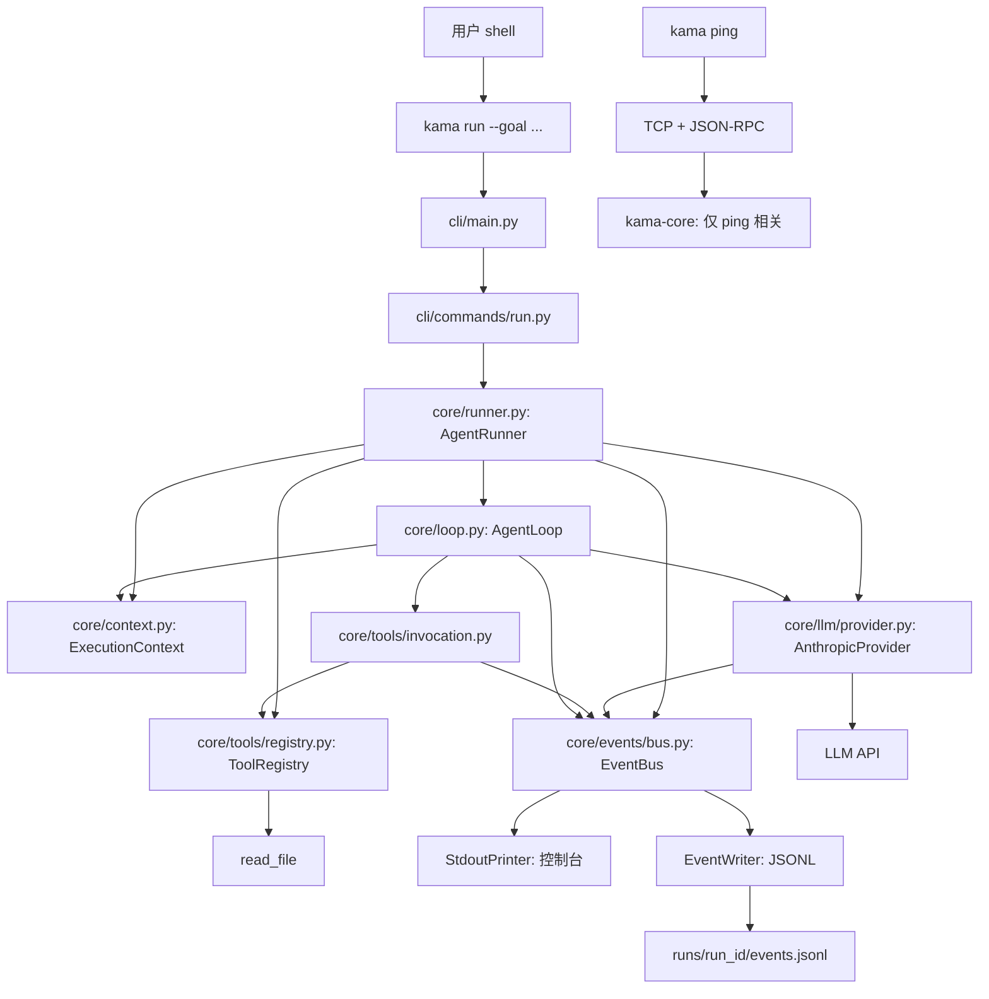
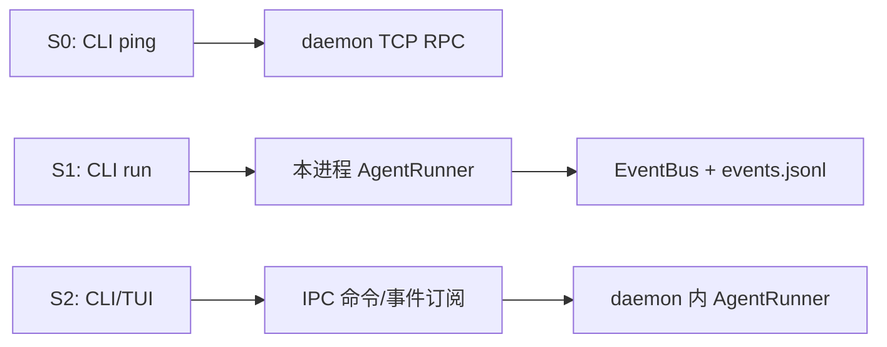

> [!abstract] 使用说明
> **适用基础**：你已经学完 [KamaClaude S0](https://github.com/youngyangyang04/KamaClaude/tree/stage/s0) 和 [learn-claude-code](https://github.com/qingwen0401/learn-claude-code) 的小型 Agent Harness。
>
> **本笔记目标**：不是重新介绍 `while True + tools`，而是将 S1 当作一个真正的 Python 工程，弄清楚「代码从哪里开始、经过哪些模块、数据是什么形状、何时结束、结果留下了什么、哪些行为是 S1 已实现而哪些要等后续阶段」。
>
> **版本边界**：以下目录、类名、函数名、常量和主要行为按仓库 `stage/s1` 的对应源码逐一核对。代码讲解中的“等价伪代码”和“示意数据”是为了教学重新组织的例子，不应误当成原仓库的逐字复制。**S1 的 `kama run` 在 CLI 进程中执行 Agent；`kama-core` 目前仍主要处理 `core.ping`。S2 才把 Runner 搬进 daemon。**
>
> **阅读方式**：按「路线地图 → 模块 → 两条数据链 → 错误与测试 → 改造练习」走一遍。Obsidian 中可直接使用目录、大纲、Mermaid、callout、复选框。

## 目录

- [[#00 一句话抓住 S1 的本质]]
- [[#01 先建立 s0、learn-claude-code、s1 的对应关系]]
- [[#02 开始之前：运行环境与复现]]
- [[#03 源码目录地图与最优阅读顺序]]
- [[#04 从用户命令进入：CLI 层]]
- [[#05 核心组装者：AgentRunner]]
- [[#06 AgentLoop：真正的循环与停止条件]]
- [[#07 ExecutionContext：消息和执行状态如何存储]]
- [[#08 LLM 层：抽象协议、返回类型和流式适配器]]
- [[#09 工具层：接口、注册表、read_file 与调用器]]
- [[#10 事件层：Event、EventBus 与 EventWriter]]
- [[#11 runs 目录：可复盘的运行记录]]
- [[#12 s0 遗留下来的 IPC、daemon、配置与启动入口]]
- [[#13 用一个读文件任务串起所有模块]]
- [[#14 异常、边界条件与源码中的真实局限]]
- [[#15 从测试反向学习源码]]
- [[#16 你需要补上的 Python 知识点]]
- [[#17 带着问题二刷：逐文件阅读检查单]]
- [[#18 动手实验：从入门到自行扩展]]
- [[#19 面试/复述：你应该能讲清楚什么]]
- [[#20 原始源码索引及学习资料]]
- [[#21 关键类与函数导航表（适合对照 IDE 逐个下断点）]]

---

## 00 一句话抓住 S1 的本质

**S0 解决「两个进程能不能通信」，S1 解决「Agent 能不能真正完成一次目标：让模型选择工具、执行工具、把结果返回模型，并把全过程记成事件文件」。**

S1 最值得看的不只是循环本身，而是把它拆为 7 个责任：

| 责任     | S1 对应代码                                            | 人话解释                |
| ------ | -------------------------------------------------- | ------------------- |
| 接收命令   | `cli/main.py`、`cli/commands/run.py`                | 终端收到目标，并开始运行        |
| 组装一次任务 | `core/runner.py`                                   | 把模型、工具、事件总线、上下文接起来  |
| 执行循环   | `core/loop.py`                                     | 模型决定、工具执行、结果回填、判断停止 |
| 存储状态   | `core/context.py`                                  | 记住目标、对话、步数、成功/失败    |
| 接入模型   | `core/llm/`                                        | 把第三方 SDK 变成项目内部统一接口 |
| 管理工具   | `core/tools/`                                      | 描述、寻找、运行、限时和报错      |
| 观察与记录  | `core/bus/events.py`、`core/events/`、`core/runs.py` | 产生、广播、保存过程事件        |

> [!important] 一定先纠正两个误会
> 1. **S1 的 `kama run` 不依赖 daemon 才能启动。** `cmd_run` 是在当前 CLI 进程内直接 `asyncio.run(runner.run(goal))`。但 `kama ping` 仍通过 TCP 找 `kama-core`。
> 2. **S1 没有完整的写文件/Bash/审批链。** `AgentRunner` 默认只注册 `ReadFileTool`；虽有基础参数必需项检查、10 秒工具超时和工具错误转结果，但还不是后面权限治理阶段的完整实现。

### 一张准确的 S1 架构图



上图两条业务线是**并存**而非连续：`kama run` 的 S1 主任务不需要经过右下方的 daemon/Ping IPC。

---

## 01 先建立 s0、learn-claude-code、s1 的对应关系

### 1.1 你不需要从头重学什么？

学过最小 harness 后，你已认识：

- `messages`：给模型的历史消息。
- `tools`：告诉模型有哪些外部能力。
- `tool_use`：模型请求使用某个工具。
- `tool_result`：程序执行后反馈给模型。
- `agent loop`：重复「模型→工具→模型」，直至模型结束。

**这就是本次的已知地基。** S1 的新知识是：如何把这些角色放到不同模块，进行依赖注入、事件观测、失败分类、配置与测试。

### 1.2 三者核心差异

| 观察维度 | KamaClaude S0 | learn-claude-code 最小阶段 | KamaClaude S1 |
|---|---|---|---|
| 核心目标 | CLI ↔ daemon 能通信 | 让模型拥有工具并循环 | 让一次 Agent run 可执行、可记录、可测试 |
| 业务入口 | `kama ping` | 简单脚本入口 | `kama run --goal ...` |
| Agent 循环 | 暂无 | 常在较集中代码中 | `AgentLoop` 单独负责 |
| 模型 | 不要求真实模型 | 最小模型 SDK 调用 | Provider 抽象 + Anthropic 实现 |
| 工具 | 无 Agent 工具 | Bash/其它逐步扩展 | 默认 `read_file` + Registry/Invoker |
| 生命周期 | RPC 请求/响应 | 对话循环 | `run`、`step`、成功/失败、最大步数 |
| 记录运行过程 | 主要日志/协议 | 教学阶段较简化 | EventBus + JSONL |
| IPC 与 Agent | 不涉及 Agent | 通常单进程 | **S1 的 run 仍在 CLI；daemon 未负责 run** |
| 可测试性 | IPC 单测/集成测试 | 单文件或小模块测试 | FakeProvider、FakeTool、临时目录 |

这里的 learn-claude-code 指其最小 Agent Loop/Tool Use 教学阶段；它的其它高阶章节也包括权限、子 Agent、上下文等机制，不应说该整个仓库只有 Bash 循环。

### 1.3 建议你带着三个问题读

1. **依赖在哪里组装？** —— `AgentRunner`。
2. **状态在哪里变化？** —— `ExecutionContext` + `AgentLoop`。
3. **过程怎么让外部看见？** —— `EventBus` + `StdoutPrinter` + `EventWriter`。

能在源文件中准确指出这三处，就先理解了工程拆分的 70%。

---

## 02 开始之前：运行环境与复现

### 2.1 按 S1 分支操作

```bash
# macOS / Linux；建议使用隔离的实验目录
git clone https://github.com/youngyangyang04/KamaClaude.git
cd KamaClaude

git switch stage/s1
# 确认当前分支
git branch --show-current

# 仓库声明 Python >=3.12,<3.13
uv sync
cp .env.example .env
```

`pyproject.toml` 的关键点：

- Python 版本：3.12.x。
- 运行库：`pydantic`、`python-dotenv`、`anthropic`。
- 开发工具：`pytest`、`pytest-asyncio`、`ruff`、`mypy`。
- 三个命令入口声明为 `kama`、`kama-core`、`kama-tui`。**“入口已声明”不等于 S1 的 TUI 主功能已经完成**。

### 2.2 配置大模型

`.env` 中按你使用的服务提供密钥，例如：

```dotenv
ANTHROPIC_API_KEY=你的密钥
KAMA_LLM_DEFAULT_MODEL=你可用的模型名
KAMA_MAX_STEPS=5
```

> [!warning] 关于模型兼容性
> S1 的 `AnthropicProvider` 实际实例化的是 `anthropic.AsyncAnthropic`，不是任意 OpenAI API 客户端。默认配置的模型名是 `claude-sonnet-4-6`，真实可用性取决于你的 API 服务和账户。**只填一个非 Anthropic 兼容接口的模型名，不能确保成功。** 若接第三方兼容服务，应检查其兼容方式和 SDK base URL 配置；这不等于 S1 已经实现通用多 Provider 路由。

### 2.3 两种运行不要混淆

```bash
# S0 继承的 IPC 例子：需要先在另一终端启动 daemon
uv run kama-core
uv run kama ping

# S1 业务主例子：直接在 CLI 进程执行 Agent
uv run kama run --goal "阅读 README.md 并用三句话概括"
```

- `kama ping` 报 `core not running` → 检查 daemon。
- `kama run` 报 API key 未设置 → 检查 `.env` 和模型配置，不是先去修 daemon。
- `kama run` 读不到文件 → 检查启动时的当前工作目录，`ReadFileTool` 以 `Path(path)` 访问。

### 2.4 先不消耗模型费用验证基本逻辑

```bash
uv run pytest tests/unit/test_context.py -v
uv run pytest tests/unit/test_loop.py -v
uv run pytest tests/unit/test_runner.py -v
uv run pytest tests/unit/test_invocation.py -v
uv run pytest tests/unit/test_llm_provider.py -v
```

这些单测使用假模型/假工具等技术，不要求真实调用 Anthropic API。**本笔记未在远程仓库现场执行测试；以上是经核对存在的测试文件及建议命令，不代表已经替你跑过。**

---

## 03 源码目录地图与最优阅读顺序

### 3.1 新手别按文件夹字母顺序读

最合适的是：**先走“谁调用谁”，再走“什么数据流经谁”，最后读“为什么有这样的边界”。**

#### 第一遍：从外到内，只看主干（约 45～75 分钟）

```text
① pyproject.toml
② src/kama_claude/cli/main.py
③ src/kama_claude/cli/commands/run.py
④ src/kama_claude/core/runner.py
⑤ src/kama_claude/core/loop.py
⑥ src/kama_claude/core/context.py
```

**第一遍重点**：跟着 `kama run` 到 `AgentLoop.run`，先不要研究 Anthropic SDK 的 stream，也不要钻 S0 的 JSON-RPC。

#### 第二遍：弄懂模型和工具（约 60～90 分钟）

```text
⑦  core/llm/types.py
⑧  core/llm/base.py
⑨  core/llm/provider.py
⑩  core/tools/base.py
⑪  core/tools/registry.py
⑫  core/tools/builtin/read_file.py
⑬  core/tools/invocation.py
```

**第二遍重点**：分别沿“模型返回 ToolCallBlock”和“工具返回 ToolResult”两条数据路径追踪。

#### 第三遍：事件、落盘与生命周期（约 40～60 分钟）

```text
⑭ core/bus/events.py
⑮ core/events/bus.py
⑯ core/events/writer.py
⑰ core/runs.py
⑱ 返回 cli/commands/run.py 阅读 StdoutPrinter
```

**第三遍重点**：看一个 `step.started` 是怎样同时抵达控制台和 `events.jsonl` 的。

#### 第四遍：回顾旧地基与验证（约 60～90 分钟）

```text
⑲ core/config.py
⑳ core/app.py
㉑ core/transport/socket_server.py
㉒ core/bus/commands.py + core/bus/envelope.py
㉓ tests/unit/test_context.py
㉔ tests/unit/test_loop.py
㉕ tests/unit/test_invocation.py
㉖ tests/unit/test_runner.py
㉗ tests/unit/test_llm_provider.py
㉘ tests/unit/test_event_bus.py + test_event_writer.py
```

### 3.2 模块地图（已核对过的关键文件）

```text
KamaClaude/
├─ pyproject.toml                  # 依赖与可执行命令入口
├─ .env.example                    # 本地变量模板
├─ README.md / RUNBOOK.md          # 用法与环境
├─ WIRE_PROTOCOL.md                # 协议与事件文档
├─ src/kama_claude/
│  ├─ cli/
│  │  ├─ main.py                   # 分发 ping / run
│  │  └─ commands/
│  │     ├─ run.py                 # StdoutPrinter + cmd_run
│  │     └─ ping.py                # S0 的 daemon IPC 通路
│  └─ core/
│     ├─ app.py                    # daemon 启动；S1 未接管 run
│     ├─ config.py                 # 配置
│     ├─ logging_setup.py          # 运行日志
│     ├─ runner.py                 # 【重点】一次 run 的组装与生命周期
│     ├─ loop.py                   # 【重点】Agent 主循环
│     ├─ context.py                # 【重点】执行状态与消息历史
│     ├─ runs.py                   # run_id / runs 路径
│     ├─ llm/
│     │  ├─ types.py               # LlmResponse / ToolCallBlock
│     │  ├─ base.py                # LLMProvider Protocol
│     │  └─ provider.py            # AnthropicProvider
│     ├─ tools/
│     │  ├─ base.py                # BaseTool / ToolResult
│     │  ├─ registry.py            # 工具注册和 schema 导出
│     │  ├─ invocation.py          # 校验、超时、工具事件
│     │  └─ builtin/read_file.py   # 默认内置读取工具
│     ├─ bus/
│     │  ├─ events.py              # 事件结构定义
│     │  ├─ commands.py            # S0 ping 命令
│     │  └─ envelope.py            # S0 JSON-RPC 信封
│     ├─ events/
│     │  ├─ bus.py                 # 发布与订阅
│     │  └─ writer.py              # events.jsonl 写入
│     └─ transport/socket_server.py# S0 TCP RPC 服务
└─ tests/
   ├─ conftest.py                  # daemon fixture
   └─ unit/
      ├─ test_context.py
      ├─ test_loop.py
      ├─ test_runner.py
      ├─ test_invocation.py
      ├─ test_tool_registry.py
      ├─ test_read_file.py
      ├─ test_llm_provider.py
      ├─ test_event_bus.py
      └─ test_event_writer.py
```

此处是**S1 阅读范围内已验证的文件索引**，不是通过完整 `git ls-files` 得到的仓库穷举列表。以本地 `git ls-files` 为最终目录清单。

### 3.3 强烈推荐的本地追踪命令

```bash
# 每个 Python 文件的函数/类定义（如未安装 rg，可换 grep）
rg -n '^(class |async def |def |    async def |    def )' src/kama_claude

# AgentRunner 与 AgentLoop 被谁调用
rg -n 'AgentRunner|AgentLoop|invoke_tool|add_tool_result' src tests

# 谁发布事件，谁订阅事件
rg -n 'bus\.publish|bus\.subscribe|\.subscribe\(bus\)' src

# 这个阶段相对 s0 实际增加/修改了什么
git diff --stat stage/s0..stage/s1
git diff --name-status stage/s0..stage/s1
```

> [!tip] 不懂一个函数怎么来的怎么办？
> **Ctrl/Cmd + 点击函数名跳转定义 → 看签名 → 看返回值 → 看它被谁调用**。前两遍不用纠结一切 import 的实现；第三遍再补全。

---

## 04 从用户命令进入：CLI 层

**对应源码**：[cli/main.py](https://github.com/youngyangyang04/KamaClaude/blob/stage/s1/src/kama_claude/cli/main.py) · [cli/commands/run.py](https://github.com/youngyangyang04/KamaClaude/blob/stage/s1/src/kama_claude/cli/commands/run.py)

### 4.1 `pyproject.toml` 是真正的终端命令入口

`[project.scripts]` 将 shell 输入的 `kama` 与 `kama_claude.cli.main:main` 联系起来。它不是 shell 自动发现项目里的同名 Python 文件；是 Python 包安装时创建的命令映射。

**顺序**：终端输入 `uv run kama run --goal "..."` → 运行 `main()` → 参数解析 → `cmd_run()`。

### 4.2 `cli/main.py` 只处理“路由”，不做 Agent 思考

关注三处：

1. `ArgumentParser`：定义命令行语法。
2. `subparsers`：分别定义 `ping`、`run`。
3. 分支选择：`ping` 调 `cmd_ping(config)`；`run` 调 `cmd_run(args.goal, config)`。

`--goal` 被标记为必需参数；因此没传 goal 时，错误先出现在命令行参数解析层，还没创建 Agent。

等价于下面的**逻辑伪代码**：

```python
command, goal = parse_user_command()
settings = load_settings()
if command == "ping":
    call_daemon_ping(settings)
elif command == "run":
    launch_agent_in_this_process(goal, settings)
```

### 4.3 `cli/commands/run.py`：把“事件”翻译成“终端显示”

核心对象：`StdoutPrinter`、`cmd_run`。

- `cmd_run` 创建 `StdoutPrinter`；构造 `AgentRunner` 时将 `printer.handle` 作为额外事件回调注入；通过 `asyncio.run` 执行一次异步 run。
- `StdoutPrinter.handle` 根据事件实际类型决定打印什么，而不是从模型消息中乱猜进度。
- 它会处理开始、每一步开始/完成、文本增量、工具调用开始/成功/失败、run 结束等事件。
- `_inline` 标记上一段 token 是否以 `end=""` 输出、尚未换行；打印 step/tool 前会先处理换行，避免文字挤在一起。
- `time.monotonic()` 用来计算持续时间，适合测量耗时而不是显示日历时间。

为什么要设计 `StdoutPrinter`，不让 `AgentLoop` 自己 `print`？

因为**业务逻辑与展示方式解耦**。AgentLoop 只说“发生了什么”，CLI 决定“以什么样式显示”。未来 S2/TUI 也可以消费事件，而无需修改 Loop 内核。

> [!question] 自测
> 如果删除 `extra_handlers=[printer.handle]`，模型和工具还能不能运行？——理论上能，Runner 仍会组装并运行；只是不会通过这个打印器显示相应事件。事件文件仍由 EventWriter 负责。

---

## 05 核心组装者：AgentRunner

**对应源码**：[core/runner.py](https://github.com/youngyangyang04/KamaClaude/blob/stage/s1/src/kama_claude/core/runner.py)

### 5.1 它的定位：不是“做决策”，而是“搭舞台”

把 `AgentRunner` 想成一次航班的地勤调度：它配飞机、机组和航线，但不替飞行员进行每次操作。AgentLoop 才负责一步步执行。

`AgentRunner.__init__` 接收：

| 形参 | 作用 | 为什么这样设计 |
|---|---|---|
| `config` | 最大步数、模型名等 | 让行为有统一配置来源 |
| `provider`（可选） | 外部注入的模型实现 | 单元测试时不访问真实 API |
| `extra_handlers`（可选） | 额外事件接收器 | CLI 等消费者独立接入 |
| `runs_dir`（可选） | run 记录保存根目录 | 测试用临时目录，不污染真实 runs |

**依赖注入**这个词可以在此记牢：一个组件不把所有依赖完全写死，而允许外部传入兼容的实现。最典型的例子是 `provider`。

### 5.2 `run(goal)` 的准确执行顺序

1. 生成唯一 `run_id`。
2. 在 `runs/<run_id>/` 创建目录。
3. 创建一个新的 `EventBus`。
4. 将 CLI 等外部 handler 订阅到总线。
5. 选择注入的 Provider；若没有，创建 `AnthropicProvider`。
6. 创建 `ToolRegistry` 并注册 **`ReadFileTool`**。
7. 创建 `AgentLoop(provider, registry, bus)`。
8. 创建 `ExecutionContext(run_id, goal, max_steps)`。
9. 进入 `async with EventWriter(...)`，开启事件文件并订阅总线。
10. 发布 `run.started`。
11. 运行 `loop.run(context)`。
12. 处理取消状态，发布 `run.finished`。
13. 退出 `async with`，关闭事件文件；需要时把取消异常继续抛出。

### 5.3 为什么要先创建 Context 再进入循环？

Context 负责**保存本次 run 的可变状态**。Loop 每一步都引用它。若信息分散成许多局部变量，最大步数、状态判断和测试都更难一致。

### 5.4 为什么 `EventWriter` 要用 `async with`？

文件打开和关闭需要成对出现。`async with` 的意义是：进入作用域打开，退出时清理；不管内部普通执行或抛出异常，都会尝试执行退出清理。

### 5.5 特别容易看错的两件事

**① Runner 是一条 run 的组装器，不等于系统常驻服务。** `kama run` 的 CLI 命令启动 Runner，S1 尚不是 daemon 运行 Agent。

**② S1 的 Runner 只默认注册 read_file。** `ToolRegistry` 支持注册更多工具，但“有扩展接口”不等于“已经实现 Bash、编辑文件、MCP”。

### 5.6 一个“谁持有谁”的视图

```text
AgentRunner
├── config (传入)
├── provider (注入或新建)
├── EventBus (每次 run 新建)
│   ├── StdoutPrinter.handle (可选)
│   └── EventWriter.handle (run 期间)
├── ToolRegistry
│   └── ReadFileTool
├── AgentLoop
│   ├── provider
│   ├── registry
│   └── bus
└── ExecutionContext
    ├── goal + run_id
    ├── messages
    ├── step / max_steps
    └── status / reason
```

---

## 06 AgentLoop：真正的循环与停止条件

**对应源码**：[core/loop.py](https://github.com/youngyangyang04/KamaClaude/blob/stage/s1/src/kama_claude/core/loop.py)

### 6.1 先把类变为一句话

`AgentLoop` 只依赖三项外部能力：**Provider（问模型）、Registry（有哪些工具）、Bus（发事件）**。它本身不创建 API key，不直接读取文件，也不直接打开 JSONL。

### 6.2 按一次迭代的顺序理解

每次循环：

1. `context.is_done()` 为假才继续。
2. `context.step` 增加 1。
3. 发布 `step.started`。
4. 调用 `provider.chat`，传入消息历史、工具 schema、bus、run_id。
5. 把模型返回的文本及工具请求整理为 assistant 消息，追加到 context。
6. 如果模型的 `stop_reason` 是 `tool_use`，依次运行所请求的工具。
7. 每个工具结果通过 `context.add_tool_result` 回填进历史。
8. 如果 `stop_reason` 是 `end_turn`，标成功；否则若已达到最大步数，标失败。
9. 发布 `step.finished`；回到循环顶部重新判断。

教学用的**等价结构示意（不是源码原文）**：

```python
async def illustrative_agent_loop(state, llm, tools, emit):
    while state.running:
        state.steps += 1
        await emit("step begins")
        reply = await llm.ask(state.history, tools.schemas())
        state.history.append(reply.as_assistant_message())

        if reply.requests_tools:
            for request in reply.tool_calls:
                outcome = await tools.execute(request)
                state.history.append_tool_outcome(request.id, outcome)

        if reply.finish_reason == "end_turn":
            state.succeed()
        elif state.steps >= state.max_steps:
            state.fail("step limit")
        await emit("step ends")
```

原代码中的执行条件是检查 **`stop_reason == "tool_use"`**，不是像示意代码这样布尔字段。记住“模型决定继续调用工具”才是关键。

### 6.3 ReAct 的 Plan / Act / Observe 在本项目对应什么？

| 阶段 | 实际动作 | 数据来源/去向 |
|---|---|---|
| Plan（选择下一步） | `provider.chat(...)` | 模型读取 `context.messages` 和工具列表 |
| Act（行动） | `invoke_tool(...)` | 调用工具，获得 `ToolResult` |
| Observe（观测结果） | `context.add_tool_result(...)` | 把结果加入后续模型可见的历史 |

源码注释的排列不能替代你的心智模型：模型收到上一轮观测才真正形成下一轮的决策。

### 6.4 停止条件要准确背下来

| 情况 | Context 结局 | 关键细节 |
|---|---|---|
| 模型返回 `end_turn` | `success` | 即使刚好达到 max_steps，也**优先判成功** |
| 模型持续 `tool_use` 直到上限 | `failed` + `exceeded_max_steps` | step 是**模型迭代次数**，不是工具调用次数 |
| LLM 调用出现普通异常 | `failed` + `llm_error` | 循环退出；该分支没有按常规路径发布 step.finished |
| 执行中发生 `CancelledError` | `failed` + `cancelled`，继续向上抛 | 与普通工具错误不同 |
| 工具未知、执行失败、超时 | **不立即使 run 失败** | 错误被转成 tool_result，供模型下一步处理 |

### 6.5 一个重要实验：`max_steps = 2`

- 第 1 步：模型要求 `read_file` → 执行工具 → 回填 → 尚未达到限制。
- 第 2 步：如果模型最终回答并返回 `end_turn` → **成功**。
- 第 2 步：如果模型继续请求工具 → 本步工具先被执行，然后达到限制 → **失败**。

因此**最大步数不代表“最多调用两个工具”**，也不保证“在限额边界前不执行最后一次工具”。它限制的是 Loop 的模型决策轮次。

### 6.6 为什么不在 Loop 内实现模型 API 细节？

这叫**接口与实现分离**。`AgentLoop` 需要“能回答 `chat` 的对象”，不需要知道“SDK 使用哪家模型”。把 SDK 专属细节放在 Provider，未来测试、替换供应商、处理不同返回格式就容易得多。

---

## 07 ExecutionContext：消息和执行状态如何存储

**对应源码**：[core/context.py](https://github.com/youngyangyang04/KamaClaude/blob/stage/s1/src/kama_claude/core/context.py)

### 7.1 它持有哪些字段？

| 字段 | 初值/类型 | 意义 |
|---|---|---|
| `run_id` | `str` | 唯一标识当前一次任务 |
| `goal` | `str` | 用户目标 |
| `max_steps` | `int` | 最大迭代步数 |
| `messages` | 空列表；之后自动加入 goal | 模型上下文历史 |
| `step` | `0` | 已经进入的循环步数 |
| `status` | `running` | 运行/成功/失败 |
| `reason` | `None` | 失败原因，可为空 |

这里用 `@dataclass`，省去了样板式 `__init__`。使用 `field(default_factory=list)` 为**每个 Context 建新的列表**，避免多个任务共享同一个可变默认列表。

### 7.2 `__post_init__` 为什么重要？

dataclass 初始化后，若消息列表为空，就自动加入首条用户消息——目标 `goal`。这让调用 Runner 的人只提供目标即可，无需再手动拼第一条 message。

### 7.3 最重要的概念：工具结果为什么也是 `role=user`？

Anthropic Messages 风格中，模型发出的工具请求位于 assistant 的 content blocks，随后的工具结果以 **user 消息里的 `tool_result` block** 提交。这是**API 消息结构的规范**，不表示真人用户亲手输出工具结果。

例如，模型决定读取 README：

```json
[
  {"role": "user", "content": "概括 README.md"},
  {
    "role": "assistant",
    "content": [
      {"type": "tool_use", "id": "call_1", "name": "read_file", "input": {"path": "README.md"}}
    ]
  },
  {
    "role": "user",
    "content": [
      {"type": "tool_result", "tool_use_id": "call_1", "content": "文件内容……"}
    ]
  },
  {"role": "assistant", "content": [{"type": "text", "text": "总结如下……"}]}
]
```

> [!tip] 记忆口诀
> **工具请求：assistant 发起；工具结果：user block 回填；`tool_use_id` 把它们配对。**

### 7.4 同一步多次工具调用怎么组织？

`add_tool_result` 检查末尾消息：若它已经是只包含 `tool_result` 的 user 消息，就把第二个结果追加进同一 content 列表；否则新建一条 user 消息。

**意义**：多个并列工具请求可形成一组工具结果。请注意：**S1 是顺序调用工具**，不是并发执行它们；“多块结果合并”与“并行执行”是两个不同概念。

### 7.5 状态切换极其简单

- `is_done()`：只检查状态是不是还在 `running`。
- `mark_success()`：置 `success`。
- `mark_failed(reason)`：置 `failed`，同时记录原因。

这一阶段还不是带丰富状态迁移约束的通用工作流状态机。**不要把不存在的“暂停、重试中、待批准”状态归功于 S1。**

---

## 08 LLM 层：抽象协议、返回类型和流式适配器

**对应源码**：[llm/types.py](https://github.com/youngyangyang04/KamaClaude/blob/stage/s1/src/kama_claude/core/llm/types.py) · [llm/base.py](https://github.com/youngyangyang04/KamaClaude/blob/stage/s1/src/kama_claude/core/llm/base.py) · [llm/provider.py](https://github.com/youngyangyang04/KamaClaude/blob/stage/s1/src/kama_claude/core/llm/provider.py)

### 8.1 先读 `types.py`：把复杂 API 对象变成内部小对象

这里有三个 dataclass：

| 类型 | 主要字段 | 为什么需要它 |
|---|---|---|
| `ToolCallBlock` | `id`、`name`、`input` | 统一表示模型请求的工具 |
| `UsageStats` | input/output/cache read/cache creation tokens | 把用量统计与 SDK 对象解耦 |
| `LlmResponse` | `stop_reason`、`tool_calls`、`text`、`usage` | Loop 只依赖这几个字段 |

**关键思想**：原始 SDK 结果往往复杂，AgentLoop 真正用到的却只有少量字段。Provider 负责把供应商专属格式转换为项目内部格式。

### 8.2 再读 `base.py`：`Protocol` 是“行为合同”

`LLMProvider` 要求兼容实现具备 `async chat(messages, tool_schemas, bus, run_id) -> LlmResponse` 这样的行为。

初学者可把 `Protocol` 想象成**“鸭子类型加静态类型约束”**：一个对象即使没显式继承这个类，只要提供兼容的 `chat` 方法，也能满足调用方的结构要求。这正是测试里 FakeProvider 可以注入 Runner/Loop 的基础。

### 8.3 最后读 `provider.py`：它做了哪些 SDK 适配？

1. 初始化 `AnthropicProvider(model, client=None)`。
2. 若没注入 client，读取环境变量 `ANTHROPIC_API_KEY`；没有密钥则直接退出初始化。
3. 创建 `anthropic.AsyncAnthropic`。
4. `chat` 先发布 `llm.model_selected`。
5. 构造 system prompt、消息、工具 schema、模型名、`max_tokens=4096` 等 API 参数。
6. 采用 Anthropic SDK 的**流式消息**接口。
7. 每获取一个文本增量，都发布 `llm.token`。
8. stream 完结后获取最终消息，提取 token 使用统计并发布 `llm.usage`。
9. 遍历最终 content，提取 `tool_use` 为内部 `ToolCallBlock`。
10. 返回 `LlmResponse`，供 Loop 判断是否调用工具或结束。

### 8.4 一定要分清流式“文本增量”和“最终完整响应”

| 内容 | 何时有 | 如何使用 |
|---|---|---|
| 文字增量 | stream 的迭代过程中 | 即时发 `llm.token`，控制台逐片段打印 |
| 完整 response | stream 结束后 | 判断 `stop_reason`、获取工具调用和用量 |

模型吐出一段文字**不等于任务结束**。`stop_reason` 才指导后续执行。

### 8.5 Prompt Caching 相关细节

该 Provider 给 system 内容设置临时缓存控制；若有工具 schema，会在最后一项工具上增加缓存控制字段。目的在于让相对稳定的上下文可以利用 Anthropic 的缓存能力。

注意：缓存命中与计费规则取决于模型/API 服务；`LlmUsageEvent` 里只是记录返回的 cache-read/cache-creation token 统计，不能仅凭配置就断言某次命中了缓存。

### 8.6 学习重点：一个 Provider 为什么同时返回结果与发布事件？

`LlmResponse` 是给 **AgentLoop 决策** 用的；`llm.token` 等事件是给 **用户界面/记录系统观察** 用的。

> **业务返回值 ≠ 可观测事件。** 同一模型调用可同时产出这两类东西。

### 8.7 一个值得自己思考的实现边界

Provider 把 streaming 的文本汇总为 `text`，再从最终消息中单独抽取工具块；Loop 又将“汇总文本 + 工具块”组织为 assistant 消息。它没有逐块保留复杂响应中所有原始 content block 的交错顺序。对于小型 S1 教学足够直观，但如果要支持高级多模态/复杂块顺序，应进一步检查并改进这一数据保真问题。

---

## 09 工具层：接口、注册表、read_file 与调用器

**对应源码**：[tools/base.py](https://github.com/youngyangyang04/KamaClaude/blob/stage/s1/src/kama_claude/core/tools/base.py) · [tools/registry.py](https://github.com/youngyangyang04/KamaClaude/blob/stage/s1/src/kama_claude/core/tools/registry.py) · [tools/builtin/read_file.py](https://github.com/youngyangyang04/KamaClaude/blob/stage/s1/src/kama_claude/core/tools/builtin/read_file.py) · [tools/invocation.py](https://github.com/youngyangyang04/KamaClaude/blob/stage/s1/src/kama_claude/core/tools/invocation.py)

### 9.1 四个文件各做一件事

| 文件 | 责任 | 记忆方法 |
|---|---|---|
| `base.py` | 定义“工具长什么样” | 接口 |
| `registry.py` | 把名字映射到工具、生成给模型看的 schema | 工具通讯录 |
| `builtin/read_file.py` | 实际读取一个文件 | 具体干活的人 |
| `invocation.py` | 调用前检查、超时、事件、错误包装 | 调度/护栏 |

### 9.2 `BaseTool` 定义了什么？

一个工具需说明：

- `name`：模型应该用哪个名字调用。
- `description`：什么场景使用。
- `input_schema`：参数格式（JSON Schema 风格）。
- `async invoke(params)`：接受参数、执行、返回 `ToolResult`。

`ToolResult` 主要包含：`content`、`is_error`、`error_type`。

**为什么定义返回对象而不是只返回字符串？** 因为“读取失败”“超时”“参数错误”在逻辑上与正常文本是不同状态，需要机器可判断的标志。

### 9.3 `ToolRegistry`：这是名字到对象的字典

Registry 内部大致就是 `dict[str, BaseTool]`。`register(tool)` 把工具放入映射；`get(name)` 查找，没有就返回 `None`；`tool_schemas()` 为所有已注册工具生成给模型可见的描述列表。

**重点辨析**：

- **注册**不等于**执行**。
- **暴露 schema**不等于**调用发生**。
- 只有模型实际产生对应工具请求且 Loop 调用 `invoke_tool`，才会执行工具。
- 以相同名称重复注册，后注册的会覆盖前一个。

### 9.4 `ReadFileTool` 的实际行为

- 工具名：`read_file`。
- 参数：必需 `path`，schema 将其声明为字符串。
- 采用 `Path(path).read_bytes()` 读取。
- 文件内容最多以 **512 KiB（512 × 1024 字节）** 解码返回，超过则附加截断标记。
- 用 UTF-8 解码，非法字节以替代字符处理。
- 检查路径组件里是否包含 `..`，发现则抛出 `PermissionError`。

### 9.5 一个真正重要的安全发现

**源码中的限制并没有严格实现“只能读取当前工作目录下的相对路径”。**

原因：它检查的是 `Path(...).parts` 中有没有 `..`，没有明确拒绝**绝对路径**，也没有把规范化路径固定在指定 workspace 下。更直观的证据：源码自带的 `test_read_file.py` 使用 `tmp_path` 构造绝对路径并断言读取成功。

所以你要写清楚：**这是 S1 的简化防护，而不是经过安全隔离的文件沙箱。** 不要将安全测试用于读取未授权的他人文件；练习时只在自己的临时目录操作。

再延伸：符号链接可能指向工作目录外的文件；仅拦截文本上的 `..` 组件也防不住这一点。生产环境需要 path resolve、限定根目录、权限策略等组合治理。

### 9.6 `invocation.py`：从工具调用请求到工具结果

**按真实顺序**：

1. 开始计时。
2. 发布 `tool.call_started`，包含 run_id、tool_use_id、工具名、参数等。
3. 从 Registry 根据名字找工具。
4. 不存在 → 转 `runtime_error` 类型的 ToolResult，并发布失败事件。
5. 做基础 required 参数存在性检查。
6. 参数缺失 → 转 `schema_error`，发布失败事件。
7. 使用 `asyncio.wait_for` 限时执行工具，**默认 10 秒**。
8. 成功 → 发布 `tool.call_finished`，返回结果。
9. 工具自己返回 `is_error=True` → 也走失败事件分支。
10. 超时 → 错误类型 `timeout`。
11. 其它普通异常 → 错误类型 `runtime_error`。

### 9.7 为什么工具失败不直接炸掉整个 Agent？

例如 `README-missing.md` 不存在。工具报告文件不存在后，Loop 将错误结果传回模型。模型仍可能改用正确文件名，或告诉用户无法读取。**工具错误是 Agent 的一条观测信息**，不一定是整个 run 的终止异常。

### 9.8 “做了参数校验”必须加限定词

S1 的调用器只检查 `input_schema['required']` 中标记的键是否存在。它**没有在此实现全面 JSON Schema 验证**，比如参数值类型、枚举、额外参数、嵌套对象规范等。

因此下面两句话意义不同：

- ✅ S1 实现了“必需参数存在性校验”。
- ❌ S1 已实现“完整参数结构验证 + 权限审批”。

### 9.9 超时也有前提

`asyncio.wait_for` 对协程的暂停点可以比较及时地取消。但是若工具内部使用同步阻塞 I/O（`read_bytes()` 就是此类方法），可能会阻塞事件循环，导致“理论上配置了 10 秒”不等于“所有文件读操作都能被强制在 10 秒物理时间内打断”。

> [!question] 自测
> 如果同一个模型响应一次请求两个 `read_file`，S1 会同时读取吗？
>
> **不会。** `AgentLoop` 对 `response.tool_calls` 采用依次 await 的方式；除非工具内部自己启动并发任务，否则是顺序执行。

---

## 10 事件层：Event、EventBus 与 EventWriter

**对应源码**：[bus/events.py](https://github.com/youngyangyang04/KamaClaude/blob/stage/s1/src/kama_claude/core/bus/events.py) · [events/bus.py](https://github.com/youngyangyang04/KamaClaude/blob/stage/s1/src/kama_claude/core/events/bus.py) · [events/writer.py](https://github.com/youngyangyang04/KamaClaude/blob/stage/s1/src/kama_claude/core/events/writer.py)

### 10.1 三层一定要区分

1. **事件定义**：`bus/events.py` 用 Pydantic 声明每一种事件有哪些字段。
2. **事件分发**：`events/bus.py` 调用每个订阅者。
3. **事件落盘**：`events/writer.py` 把事件写入 `events.jsonl`。

不要因为 `bus` 同时出现在目录名 `core/bus/` 和类名 `EventBus` 中，就误认所有事件都已经通过 TCP/IP 推给 daemon 或 TUI。**S1 的 EventBus 是本进程内的事件分发器。**

### 10.2 主要事件种类（S1 已定义）

| `type` | 由谁发布/何时 | 关键作用 |
|---|---|---|
| `run.started` | Runner 开始任务 | 标识目标和 run_id |
| `run.finished` | Runner 完成清理前 | 标识状态、原因、步数 |
| `step.started` | Loop 每一轮开始 | 当前 step |
| `step.finished` | Loop 正常走完当轮末尾 | step 完成 |
| `llm.model_selected` | Provider 开始模型调用时 | 本次使用哪个模型、策略 |
| `llm.token` | Provider 收到文本片段 | 逐片段输出 |
| `llm.usage` | Provider 收到完整消息后 | 统计 token 使用 |
| `tool.call_started` | 调用工具之前 | 工具名、参数、调用 id |
| `tool.call_finished` | 工具正常返回 | 时间统计 |
| `tool.call_failed` | 工具异常、未知工具、缺参或超时 | 错误分类和信息 |
| `log.line` | 模型已定义 | 供结构化日志事件使用；不要误认每次必发 |
| `core.started` | IPC 相关事件模型 | 与 run 事件用途不同 |

严格区分“已定义事件类型”与“当前执行路径一定发布的事件类型”。

### 10.3 Pydantic 与判别联合是什么？

事件模型继承 `BaseModel`，字段具备结构约束，并定义一个常量 `type`。`Event` 是使用 `type` 字段进行区分的判别联合。

这样当外部需要将 JSON 数据还原成结构化对象时，可以根据 `type` 分辨不同事件，避免全靠 `if "tool_name" in data` 等脆弱推断。

### 10.4 EventBus 并没有神秘队列

S1 的发布者订阅模式很轻：`subscribe(handler)` 将异步处理函数放到列表；`publish(event)` **按订阅顺序逐个 `await handler(event)`**。

它意味着：

- handler 是异步回调，返回 `Awaitable[None]`。
- 发布事件时当前调用方会等消费者处理完成。
- 发布者不必知道是终端、JSONL、还是未来的 TUI 消费事件。
- **不是异步消息队列/独立线程/跨进程广播**。
- 某一个订阅者很慢，会拖慢发布；未捕获的订阅者异常也可能向上影响发布方。

### 10.5 为什么调用顺序很重要？

Runner 中**先注册 extra_handlers，再注册 EventWriter**。因此一个事件会先传给 `StdoutPrinter` 等外部订阅者，再走文件写入。这种设计不等于具有事务性、可靠的两阶段提交。

### 10.6 `EventWriter`：JSONL 是什么？

JSONL = JSON Lines，一行一条独立 JSON。比如下面的**示意记录**：

```jsonl
{"type":"run.started","run_id":"demo-001","goal":"概括 README.md","ts":"2026-10-09T00:00:00Z"}
{"type":"step.started","run_id":"demo-001","step":1,"ts":"2026-10-09T00:00:01Z"}
{"type":"tool.call_started","run_id":"demo-001","tool_use_id":"t1","tool_name":"read_file","params":{"path":"README.md"},"ts":"2026-10-09T00:00:02Z"}
{"type":"tool.call_finished","run_id":"demo-001","tool_use_id":"t1","tool_name":"read_file","elapsed_ms":3,"ts":"2026-10-09T00:00:03Z"}
```

这是**结构示例而非真实运行截图**，故省略了同一次 run 的其它事件。

`EventWriter` 使用追加模式打开文件；对每个事件调用 `model_dump_json()`，尾部加 `\n`，写入后 flush；退出时关闭。写入中的 `OSError`/`ValueError` 会记录日志而不继续抛出。

### 10.7 events ≠ messages ≠ logs

| 名称 | 记录内容 | 目标读者 |
|---|---|---|
| `context.messages` | 喂回模型的对话内容 | 模型 |
| `events.jsonl` | 执行时间线：开始、step、token、工具、状态 | UI/调试/复盘 |
| logging 文件 | 工程诊断日志 | 维护者 |

很多初学者会误认为 events.jsonl 可直接作为完整会话恢复文件。**S1 的它是执行事件记录，不是完整的上下文续聊存储机制。**

---

## 11 runs 目录：可复盘的运行记录

**对应源码**：[core/runs.py](https://github.com/youngyangyang04/KamaClaude/blob/stage/s1/src/kama_claude/core/runs.py)

### 11.1 每次运行生成一个新的 run_id

`new_run_id()` 将 UTC 时间字符串与 UUID 的短随机后缀组合。格式类似：

```text
YYYYMMDD-HHMMSS-xxxxxx
```

这里 run_id 的主要用途不是安全授权令牌，而是**一次任务过程的关联标识**。

### 11.2 文件结构

```text
工作目录/
└── runs/
    ├── 20261009-010203-a1b2c3/
    │   └── events.jsonl
    └── 20261009-010845-d4e5f6/
        └── events.jsonl
```

`RUNS_DIR = Path("runs")` 是相对路径，所以文件会出现在**执行命令时的当前工作目录**下，而不是固定在 `~/.kama`。测试通过 `runs_dir=tmp_path` 覆盖此位置。

### 11.3 常用查看命令

```bash
# 列出 runs 文件夹中的记录（先确认你在正确工作目录）
find runs -name events.jsonl -type f

# 获取一个已知文件的最后若干条事件
tail -n 20 runs/<你的run_id>/events.jsonl

# 若已安装 jq，逐行提取事件类型
jq -r '.type' runs/<你的run_id>/events.jsonl

# 筛选失败事件
jq 'select(.type == "tool.call_failed" or .status == "failed")' runs/<你的run_id>/events.jsonl
```

> [!note] 本阶段实际记录了什么？
> 能够确认的是 Runner/Loop/Provider/Invoker 发布的事件与 EventWriter 的持久化。**不要自动假定 S1 已有“完整 trace 回放引擎”“会话增量保存”“恢复 run”功能。**

---

## 12 s0 遗留下来的 IPC、daemon、配置与启动入口

对应：[core/app.py](https://github.com/youngyangyang04/KamaClaude/blob/stage/s1/src/kama_claude/core/app.py) · [socket_server.py](https://github.com/youngyangyang04/KamaClaude/blob/stage/s1/src/kama_claude/core/transport/socket_server.py) · [bus/envelope.py](https://github.com/youngyangyang04/KamaClaude/blob/stage/s1/src/kama_claude/core/bus/envelope.py) · [bus/commands.py](https://github.com/youngyangyang04/KamaClaude/blob/stage/s1/src/kama_claude/core/bus/commands.py) · [config.py](https://github.com/youngyangyang04/KamaClaude/blob/stage/s1/src/kama_claude/core/config.py)

### 12.1 为什么还需要看 S0 模块？

因为你正在学习的是一个**逐阶段演进的工程**。S1 没有丢掉 S0 的 IPC 基础，但暂时不把 run 接入它。看清“已存在的架构边界”与“当前尚未接线的功能”，后续理解 S2 会非常省力。

### 12.2 `core/app.py`（daemon）

在 S1 可核对到：

- `CoreApp.run()` 初始化配置和 logging。
- 创建 `SocketServer(host, port)`。
- 注册 `"core.ping"` 处理器。
- 启动监听、等待 `SIGINT/SIGTERM`、停止 server。

**没有在这里注册 `agent.run` 处理器。** 因而不能画成 `kama run → TCP → daemon → AgentRunner`；那样会把后续阶段误写到 S1。

### 12.3 `SocketServer`（S0 复习）

负责 TCP loopback + 换行分隔 JSON：

1. `asyncio.start_server` 启动监听。
2. 客户端建立连接。
3. `reader.readline()` 读取一条 NDJSON frame。
4. JSON 解码，并用 `JsonRpcRequest` 校验。
5. 根据 `method` 找 handler。
6. `await handler(params)`。
7. 封装结果或错误，写回 JSON-RPC response，并调用 `drain()`。

JSON-RPC 2.0 是 RPC 信封协议，NDJSON 是传输分帧方式，TCP 是下层字节连接。三者不是同一个概念。

### 12.4 `config.py` 的扩展

S1 的配置由以下 dataclass 组成：

- `LoggingConfig`：level、file、format。
- `AgentConfig`：`max_steps`，默认 **20**。
- `LlmConfig`：`default_model`、`router`，router 初值 `static`（其它策略被注释为后续阶段）。
- `KamaConfig`：把核心地址、日志、agent、llm 聚合起来。

优先级（低 → 高）：内建默认值 → TOML 文件 → `.env` → 已存在的真实系统环境变量。`load_dotenv(override=False)` 是理解这个优先级的重要代码线索。

TOML 主要使用 `[core]`、`[logging]`、`[agent]`、`[llm]` 小节。环境变量至少包括 `KAMA_MAX_STEPS`、`KAMA_LLM_DEFAULT_MODEL` 等。

### 12.5 S1 与后续 S2 的衔接



S2 的目标是把主任务运行时迁移到 daemon，并通过 IPC 将事件外化；这是**演进方向**，不是当前 S1 已经做完的功能。

---

## 13 用一个读文件任务串起所有模块

### 13.1 情境

执行：

```bash
uv run kama run --goal "请阅读 README.md，告诉我项目主要解决什么问题"
```

为了帮助理解，假设模型总共经历两次调用：第一次发起 `read_file`，第二次输出总结。真实模型的行为、文本、事件数量因运行环境和模型而异。

### 13.2 从入口到结束的时序图

```mermaid
sequenceDiagram
    participant User as 用户
    participant CLI as CLI / cmd_run
    participant Runner as AgentRunner
    participant Bus as EventBus
    participant Loop as AgentLoop
    participant Ctx as ExecutionContext
    participant LLM as AnthropicProvider
    participant Tool as invoke_tool / read_file
    participant File as EventWriter
    User->>CLI: kama run --goal ...
    CLI->>Runner: run(goal)
    Runner->>Ctx: 创建消息与状态
    Runner->>Bus: 订阅 CLI、EventWriter
    Bus->>File: run.started
    Runner->>Loop: run(context)
    Loop->>Bus: step.started #1
    Loop->>LLM: chat(messages, schemas)
    LLM-->>Bus: llm.model_selected / tokens / usage
    LLM-->>Loop: LlmResponse(tool_use)
    Loop->>Ctx: add_assistant_message
    Loop->>Tool: invoke_tool(read_file)
    Tool-->>Bus: tool.call_started / finished
    Tool-->>Loop: ToolResult(content)
    Loop->>Ctx: add_tool_result
    Loop->>Bus: step.finished #1
    Loop->>Bus: step.started #2
    Loop->>LLM: chat(更新后的messages, schemas)
    LLM-->>Loop: LlmResponse(end_turn)
    Loop->>Ctx: add_assistant_message + success
    Loop->>Bus: step.finished #2
    Runner->>Bus: run.finished
    Bus-->>File: 每次发布时持续写入事件行
    Runner-->>CLI: run结束
```

> [!note] 时序图简化说明
> 这是教学示意：真实情况下 `run.started` 同样广播给 CLI 打印器；模型提供 token 和 usage 的顺序遵循 Provider 的实现；每个事件都会在发布时依次送达订阅者，而不是在最后一次性写入。

### 13.3 按秒表一样追踪关键数据

#### T0：CLI 获得用户 goal

- `main()` 解析 `run` 与 `--goal`。
- `cmd_run` 将 goal 和 config 传给 Runner。

#### T1：Runner 创建执行环境

- `run_id` 新生成。
- `context.messages` 初始只有一条 user goal。
- Registry 中有 `read_file`。
- Bus 连着终端输出和 JSONL 文件写入。

#### T2：Loop 进入第一步

- `step` 从 0 变 1。
- 发 `step.started`。
- `provider.chat` 收到 goal 和 schema。

#### T3：Provider 返回工具请求

模型返回一个带 `id/name/input` 的工具调用块：

```json
{"id":"tool_demo_1","name":"read_file","input":{"path":"README.md"}}
```

注意：这只是**模型说想使用工具**；并不是 SDK 自动执行本地文件读取。

#### T4：Loop 调度工具

- `invoke_tool` 检查 Registry 中是否有 `read_file`。
- 检查是否存在 `path`。
- 调用真正的 `ReadFileTool.invoke`。
- 把读到的文本包装为 `ToolResult`。
- 产生开始/结束事件。

#### T5：回填观察结果

- `context.add_tool_result(tool_demo_1, 文件内容)`。
- 历史中出现与调用 id 对应的工具结果。

#### T6：Loop 第二步

- `step` 从 1 变 2。
- 再次把整个当前 `context.messages` 交给 Provider。
- 模型此时**看到了文件内容**，因此可以回答。

#### T7：任务完成

- `stop_reason=end_turn` → `context.mark_success()`。
- Loop 结束，Runner 发布 `run.finished(status=success, steps=2)`。
- 事件文件写完并关闭。

### 13.4 你应能默写的主流程

```text
goal
 ↓
CLI 解析
 ↓
Runner 组装（Bus / Provider / Registry / Context / Loop）
 ↓
Loop：发布 step.started
 ↓
Provider：messages + tool_schemas → LlmResponse
 ↓
append assistant message
 ↓
有 tool_use 吗？— 是 → invoke_tool → ToolResult → append user tool_result
 ↓                                      ↓
无 / 下一步 ←────────────────────────────┘
 ↓
判断 end_turn / max_steps / LLM error
 ↓
发布 step.finished / run.finished
 ↓
控制台输出 + events.jsonl
```

### 13.5 特别值得画的两条独立“流”

**数据流**（给模型）：

```text
goal → assistant(tool_use) → user(tool_result) → assistant(final)
```

**观测流**（给用户、日志）：

```text
run.started → step.started → llm.* → tool.call_* → step.finished → ... → run.finished
```

两条流的区别是源码理解的核心之一。

---

## 14 异常、边界条件与源码中的真实局限

> [!warning] 本节用于理解真实源码，不代表建议在普通使用中执行危险的操作。示例验证一律放在自己创建的临时项目目录内。

### 14.1 失败边界清单

| 场景 | S1 的实际效果或限制 | 最合适的理解 |
|---|---|---|
| `ANTHROPIC_API_KEY` 未设 | 默认 Provider 初始化阶段退出 | 可能尚未创建 `EventWriter` 或发布 `run.started` |
| LLM 请求出现普通异常 | Loop 记录 `llm_error` 并退出 | 可有 `run.finished`；该失败轮不保证 `step.finished` |
| 取消 LLM 调用 | 标记 cancelled 并重新抛出取消异常 | 取消属于控制流事件，与工具返回错误不同 |
| 找不到工具名 | 失败事件 + 错误 ToolResult | Model 下一轮可处理 |
| 缺少必需参数 | `schema_error` | 只检查必需键的存在，不做完整 schema 校验 |
| 工具主动返回 `is_error=True` | 失败事件 + 错误结果 | 失败被反馈给 Agent，而非必然终止 run |
| 工具抛普通异常 | 捕获后转 `runtime_error` | 包括 FileNotFoundError 等 |
| 工具协作式超时 | 转 `timeout` | 同步阻塞工作不保证精确截止 |
| 模型第 N 步输出最终答复 | `end_turn` 胜过步数上限 | N 等于 max_steps 时仍可成功 |
| 模型第 N 步仍要求工具 | 当轮工具执行后标最大步数失败 | 上限约束的是模型轮次 |
| events.jsonl 写入失败 | Writer 记录 logging 错误 | 可能导致“任务完成但事件记录缺失” |
| EventBus 订阅者抛异常 | 发布链路可能被打断 | 它不是带异常隔离/重试的队列 |
| ReadFile 的绝对路径 | 目前实现未拒绝 | 严格隔离的安全逻辑留待改进 |

### 14.2 工程意义：S1 的“成功”不等于“目标确实正确完成”

现阶段 `mark_success()` 主要由模型返回 `end_turn` 触发。**没有独立的任务完成验证器**去证明“模型宣称完成了”与“现实成果正确”必定一致。

这一点对于理解 agent harness 非常重要：把模型终止视为流程完成，和验证现实任务成果，是两个工程层次。

### 14.3 隐藏的资源问题：上下文会增长

每次模型调用都接收 `context.messages`，工具的文件文本也进入其中；目前尚未看到 S1 引入成熟的自动 compact、总结式上下文缩减或跨会话记忆分层。这意味着复杂任务的消息历史可能越来越长。

这正是后续上下文治理阶段需要处理的问题。

### 14.4 为什么 S1 不直接实现完整工具权限？

分阶段学习有意先实现最小闭环。此时你要能将：

- **工具功能是否存在**
- **工具接口是否可扩展**
- **工具参数是否校验**
- **工具执行是否经过授权**

视作四件事。S1 主要实现前两项，加上基础必需参数检查和超时/错误包装；不要把它包装成生产级安全系统。

### 14.5 哪些问题是阅读代码就能发现的？

- 工具执行按顺序 `await`，不是并发。
- 事件总线同步顺序等待 handler，不是后台队列。
- 输出截断的是 read_file 返回内容，不是实际磁盘读取量。
- 默认只注册 read_file，不能据 Registry 的通用类设计声称 Bash 已具备。
- Agent 并未通过 daemon 接收 run；S2 才解决这层系统边界。
- `LogLineEvent` 类型存在，不表示每轮必然发出。

---

## 15 从测试反向学习源码

**源码入口索引**：

- [test_context.py](https://github.com/youngyangyang04/KamaClaude/blob/stage/s1/tests/unit/test_context.py)
- [test_loop.py](https://github.com/youngyangyang04/KamaClaude/blob/stage/s1/tests/unit/test_loop.py)
- [test_runner.py](https://github.com/youngyangyang04/KamaClaude/blob/stage/s1/tests/unit/test_runner.py)
- [test_invocation.py](https://github.com/youngyangyang04/KamaClaude/blob/stage/s1/tests/unit/test_invocation.py)
- [test_read_file.py](https://github.com/youngyangyang04/KamaClaude/blob/stage/s1/tests/unit/test_read_file.py)
- [test_tool_registry.py](https://github.com/youngyangyang04/KamaClaude/blob/stage/s1/tests/unit/test_tool_registry.py)
- [test_llm_provider.py](https://github.com/youngyangyang04/KamaClaude/blob/stage/s1/tests/unit/test_llm_provider.py)
- [test_event_bus.py](https://github.com/youngyangyang04/KamaClaude/blob/stage/s1/tests/unit/test_event_bus.py)
- [test_event_writer.py](https://github.com/youngyangyang04/KamaClaude/blob/stage/s1/tests/unit/test_event_writer.py)

### 15.1 测试其实是“需求说明书”

每个测试最值得研究的不是 assert 语法，而是：**为什么这个行为必须固定？**

| 测试文件 | 重点验证内容 | 建议先看哪些测试 |
|---|---|---|
| `test_context.py` | 首条 goal、消息顺序、工具结果合并、is_error | `test_multiple_tool_results_share_one_message` |
| `test_loop.py` | end_turn、max_steps、工具失败继续循环、取消、LLM 失败 | `test_tool_use_then_end_turn_marks_success` |
| `test_runner.py` | RunStarted/Finished、事件落盘、run 子目录、配置传递 | `test_events_jsonl_created_with_started_and_finished` |
| `test_invocation.py` | 未知工具、缺参、超时、运行错误、事件先后顺序 | `test_timeout_gives_timeout_error` |
| `test_read_file.py` | 成功读取、路径遍历拒绝、512KiB 截断、空文件 | `test_read_existing_file` |
| `test_tool_registry.py` | register/get、schema 列表、同名覆盖 | `test_register_same_name_overwrites` |
| `test_llm_provider.py` | 文本增量、usage、tool_use 提取、缺 API key | `test_tool_use_parsed_from_final_message` |
| `test_event_bus.py` | 多订阅者、顺序、无订阅者 | `test_subscribers_called_in_order` |
| `test_event_writer.py` | JSONL、追加、自动建目录、关闭文件/写错误 | `test_event_writer_writes_jsonl` |

### 15.2 不接真实 API 也能测试 Agent Loop，靠什么？

源码中的 `_MockProvider` / `_EndTurnProvider` / `_LoopingProvider` 等**测试替身**模拟 LLM 输出。例如：

- 第一次返回一个工具调用请求；
- 第二次返回最终回答；
- 测试断言 context.step 为 2，状态 success。

如果真实 API 参与，每次输出可能不同，无法稳定断言。**对需要重复、可预测结果的单元测试，注入假 Provider 是关键技巧。**

### 15.3 `tmp_path` 是什么？

Pytest 提供的临时目录 fixture。Runner 测试将 `runs_dir` 指向 `tmp_path`，让事件文件在隔离目录产生，测试结束无需污染用户工作目录。

### 15.4 你可以额外自己补的测试（进阶）

1. 同一步出现两个工具调用，断言执行顺序、消息合并结果。
2. FakeProvider 在第一轮抛出异常，断言 run.finished.status 与 reason。
3. 一个订阅者故意抛异常，观察事件是否能继续到其它订阅者。
4. 创建测试工作目录内的符号链接，验证 ReadFile 当前路径限制的不足，**仅验证自己拥有的安全样例文件**。
5. read_file 使用错误类型的 `path` 值，研究当前 required-only 检查行为。
6. MaxSteps = 1 且模型直接 `end_turn`，断言成功优先级。

### 15.5 不要把“测试文件存在”和“测试通过”混为一谈

这里按公开源码读过测试用例并说明其意图；具体测试是否在你的机器上通过，仍取决于所安装依赖、Python 版本和环境。你要自己运行测试，把结果补入本笔记末尾。

---

## 16 你需要补上的 Python 知识点

本节不是完整 Python 教程，而是“S1 不懂代码时应该先补哪一个知识点”的索引。

### 16.1 `async def` 与 `await`

`async def` 定义协程函数，调用它通常得到协程对象；必须由事件循环驱动，使用 `await` 获取执行结果。`asyncio.run(...)` 为 CLI 创建事件循环并执行顶层协程。

和同步代码比：**看到 `await` 时应问“等的是 I/O、回调、还是一个工具动作？”**

### 16.2 `async with`

异步上下文管理协议。`EventWriter` 实现 `__aenter__` / `__aexit__`，用于将“打开文件”与“关闭文件”绑定在作用域两端。

### 16.3 `@dataclass`

帮助定义以数据字段为主的类，减少初始化样板代码。注意 `default_factory=list` 避免不同实例共享同一个列表。

### 16.4 `Protocol`

结构化接口。只关心“有没有兼容的 chat 方法”，而不是只允许指定的继承链。便于替换真实/测试 LLM 实现。

### 16.5 `ABC` / `@abstractmethod`

抽象基类定义工具实现必须提供 `invoke`。与 Protocol 的区别：ABC 更偏显式继承型约定；Protocol 可做结构化约束。

### 16.6 `dict[str, object]` 与 `Any`

`dict[str, object]` 表示键是字符串、值为任意 Python 对象但使用时仍需要类型收窄；`Any` 会放宽类型检查。S1 的模型消息与工具输入在很多地方用了宽类型，方便教学，也意味着运行期校验仍有价值。

### 16.7 Pydantic `BaseModel`

用于结构化输入数据、验证与序列化。典型方法有 `model_validate`（外部数据转模型）、`model_dump`（模型转普通 Python 数据）、`model_dump_json`（模型转 JSON 字符串）。

### 16.8 `time.monotonic()` 与 `datetime.now(UTC)`

- monotonic：适合**测量耗时**，不受墙上时钟调整影响。
- UTC datetime：适合**事件时间戳与跨系统记录**。

### 16.9 `asyncio.wait_for`

为 awaitable 设置等待上限，并在超时情况下触发取消/超时处理。这里用于工具调用；必须理解协作式取消的限制。

### 16.10 `Path` / `read_bytes()` / UTF-8

文件读取以字节为单位，随后再解码成文本。512KiB 讲的是**字节**，不保证等于 512K 个汉字。`errors="replace"` 能容忍非法 UTF-8，但会以替代字符丢失原始字节信息。

### 16.11 `try/except` 与 `CancelledError`

有的异常应该被转换为工具失败结果（供模型继续修复）；有的取消应该向上终止 run。区分“业务失败”“环境故障”“主动取消”非常关键。

### 16.12 Python packaging / `uv`

`pyproject.toml` 定义包配置与入口，`uv sync` 安装/同步依赖，`uv run` 在对应环境下执行。无需把它混同为 Python 语言本身的标准库。

---

## 17 带着问题二刷：逐文件阅读检查单

> [!tip] 二刷方法
> 打开对应文件，不看本笔记回答问题；尝试自己写出“调用者 → 被调用者 → 输入 → 输出 → 错误行为”。能回答后勾选。

### 主干

- [ ] `pyproject.toml`：`kama` 这个 shell 命令究竟映射到哪个 Python 函数？
- [ ] `cli/main.py`：为什么 `--goal` 在这里解析，不在 AgentLoop 里解析？
- [ ] `cli/commands/run.py`：什么代码真正启动了异步 Agent run？
- [ ] `core/runner.py`：模型、工具、Bus、Loop、Context 在哪些行被创建？
- [ ] `core/loop.py`：状态何时由 running 变成 success 或 failed？
- [ ] `core/context.py`：工具结果为什么是 user message？

### LLM

- [ ] `llm/types.py`：完整 LLM SDK 对象为什么要变为项目自己的 `LlmResponse`？
- [ ] `llm/base.py`：假 Provider 为什么不必继承 AnthropicProvider？
- [ ] `llm/provider.py`：工具 schema 在什么时候交给模型？
- [ ] `llm/provider.py`：每个 token 如何变为事件？
- [ ] `llm/provider.py`：最终 `stop_reason` 来自哪里？

### 工具

- [ ] `tools/base.py`：工具最小接口是什么？
- [ ] `tools/registry.py`：模型看到的 schema 是否等于真正执行工具？
- [ ] `tools/builtin/read_file.py`：截断发生在读取前还是读取后？
- [ ] `tools/invocation.py`：未知工具、缺参、超时各产生什么类型的结果？
- [ ] `tools/invocation.py`：错误怎样回到 Loop 而不是直接退出 run？

### 事件和环境

- [ ] `bus/events.py`：列出五个最重要的事件及关键字段。
- [ ] `events/bus.py`：两个订阅者会并发执行吗？
- [ ] `events/writer.py`：事件以什么格式保存？
- [ ] `runs.py`：run 文件位置由什么决定？
- [ ] `core/app.py`：S1 daemon 是否注册了执行 Agent 的方法？
- [ ] `core/config.py`：配置的 `max_steps` 如何最终影响 Loop？

---

## 18 动手实验：从入门到自行扩展

### 实验 A：只靠 FakeProvider 跑一次成功任务（⭐）

**目的**：绕开真实 API，理解一次 run 的生命周期。

1. 仔细读 `tests/unit/test_runner.py` 中 `_EndTurnProvider`。
2. 找到 Runner 的 `provider` 注入点。
3. 运行该测试文件。
4. 观察 `runs_dir=tmp_path` 的意义。
5. 写下：`run.started` 和 `run.finished` 由哪个模块发出？

**完成标准**：你能口述一遍“假模型即使不调用 API，Runner 仍能生成事件文件”的原因。

### 实验 B：观察两轮消息如何变化（⭐⭐）

**目的**：把 `tool_use_id` 与 `tool_result` 绑定起来。

1. 阅读 `tests/unit/test_loop.py` 的工具调用成功测试。
2. 找到用于回填结果的方法。
3. 在自己的实验分支中，给测试增加对 `context.messages` 长度、role 顺序的断言。
4. 验证顺序：user goal → assistant tool_use → user tool_result → assistant final。

**完成标准**：不用笔记也能画出四条消息的 JSON 结构。

### 实验 C：工具错误分类（⭐⭐）

**目的**：理解 `invoke_tool` 的护栏。

1. 运行 `test_invocation.py`。
2. 找到测试中模拟未知工具、缺少必需参数、超时的方式。
3. 解释 `schema_error`、`timeout`、`runtime_error` 的触发点。
4. 思考：为什么工具失败时测试仍有事件 `tool.call_started`？

**完成标准**：能够说出“事件开始 → 检查/执行 → 结束或失败”三段式。

### 实验 D：自己新增一个只读工具（⭐⭐⭐）

建议做 `list_local_files`（限定在你建立的教学用文件夹内）。

**任务**：设计输入 `folder`（相对路径），输出该目录下一层的文件名；不要执行 shell，也不要递归读取敏感内容。

**实施步骤**：

1. 新建一个实现 `BaseTool` 的类。
2. 提供 `name`、`description`、`input_schema`。
3. 实现异步 `invoke`，返回 `ToolResult`。
4. 在 `AgentRunner` 新建 Registry 后注册它。
5. 给它增加工具接口与路径校验测试。
6. 用 FakeProvider 发出此工具的调用，查看 `tool.call_started` 和 `tool.call_finished`。

**重点不是工具多强，而是验证扩展能力完全不需要改 AgentLoop 的主体结构。**

### 实验 E：重现安全边界并提出修正方案（⭐⭐⭐）

- 创建你拥有的临时目录和两个无敏感内容的文本文件。
- 比较相对路径、绝对路径和包含 `..` 的路径在当前 ReadFileTool 下的行为。
- 草拟“给定 workspace 根目录、先 normalize/resolve、确认真实路径在根目录内、处理 symlink”方案。
- 先设计测试，再实施任何修改。

**完成标准**：能解释为什么仅检查 `..` 不代表文件访问沙箱。

### 实验 F：设计“未来的 S2”接口（⭐⭐⭐⭐）

不必真的全部实现，只写设计草稿：

- daemon 应注册什么 run 命令？
- CLI 如何订阅事件？
- EventBus 怎样从“本进程回调”延伸为“IPC 事件转发”？
- 若 CLI 断开连接，run 应继续还是停止？
- 用什么 id 区分客户端、run 与事件？

这能帮助你把 S1 与后续课程连成一个完整工程，而不是孤立看代码。

---

## 19 面试/复述：你应该能讲清楚什么

### 19.1 60 秒解释 S1

> KamaClaude S1 在 S0 的 CLI/daemon 协议骨架上新增可执行的 Agent 最小闭环。用户在 CLI 输入目标后，CLI 本地创建 AgentRunner；Runner 组装 LLM Provider、ToolRegistry、ExecutionContext、AgentLoop 和 EventBus。Loop 反复调用模型，根据 stop_reason 决定运行工具或完成任务；工具通过统一调用器进行基础参数检查、超时和错误包装，结果回填消息历史。事件通过总线分别用于终端展示及 JSONL 落盘。S1 主要解决单次 run 的可执行、可观测、可测试问题；Runner 进入 daemon 以及事件流经 IPC 对外订阅，是后续阶段的工程目标。

### 19.2 20 个高频自问与参考答案

1. **S1 和最小 Agent Loop 最大差异？** —— 工程拆分、事件生命周期、运行记录、注入测试。
2. **S1 的 AgentRunner 在 daemon 里吗？** —— 不在，`kama run` 的 CLI 直接创建它。
3. **为什么有 Provider 接口？** —— 解耦模型供应商与 AgentLoop，同时可注入测试替身。
4. **Loop 如何知道有哪些工具？** —— Registry 提供 `tool_schemas()`。
5. **模型是否直接调用了本地文件 API？** —— 否。模型只输出请求，由 harness 执行。
6. **工具执行在哪里？** —— `invoke_tool` 寻找工具并调用 `tool.invoke`。
7. **为什么工具结果是 user role？** —— Anthropic Messages 的 `tool_result` 协议格式。
8. **一个 step 等于一个工具调用吗？** —— 否，step 是一次模型决策轮次。
9. **如何判断 run 成功？** —— 在 S1 主要依赖 `stop_reason=end_turn`。
10. **最大步数达到时一定失败吗？** —— 若本步 `end_turn`，成功优先。
11. **工具超时会直接退出 Agent 吗？** —— 普通工具超时转错误结果，Loop 可以继续。
12. **S1 已有完整权限审批吗？** —— 没有。
13. **EventBus 是跨进程消息队列吗？** —— 不是，S1 是顺序执行的本地回调分发器。
14. **为什么需要 EventWriter？** —— 将过程事件以 JSONL 保存，方便复盘。
15. **EventWriter 记录的是会话完整 memory 吗？** —— 不是。
16. **为什么单测可以不用模型 API？** —— Runner/Loop 接受符合 Protocol 的假 Provider。
17. **ReadFileTool 是否安全限制在 cwd 下？** —— 没有完全实现，允许绝对路径等问题需要治理。
18. **模型文本 token 和 stop_reason 分别何时获得？** —— token 流式输出；最终消息包含终止原因和工具调用信息。
19. **S1 默认有哪些已注册工具？** —— `ReadFileTool`。
20. **下一个 S2 最关键的系统改变？** —— 把执行运行时迁至 daemon，并用 IPC 对客户端暴露事件。

### 19.3 最常见的错误表述（别踩）

- ❌ “S1 已经实现多客户端订阅 Agent 任务” → ✅ 这属于后续迁移/外化阶段。
- ❌ “工具 schema 保证所有输入安全” → ✅ 当前只有非常基础的必需字段检查。
- ❌ “工具失败意味着 run 失败” → ✅ 多数工具失败会成为模型下一轮可观察的错误结果。
- ❌ “事件总线是异步并发的” → ✅ 当前顺序 await handler。
- ❌ “512KB 限制让程序只读 512KB 文件” → ✅ 它先读文件字节，再截取返回内容。
- ❌ “有 EventWriter 就能恢复历史会话” → ✅ 事件记录不等同于可恢复的上下文存储。

---

## 20 原始源码索引及学习资料

> [!info] 溯源建议
> 链接均指向明确的 `stage/s1` 分支，避免你阅读 `main` 后误把 S4～S7 的最终功能归入 S1。

### 最核心 10 个源码入口

1. [CLI 命令入口：cli/main.py](https://github.com/youngyangyang04/KamaClaude/blob/stage/s1/src/kama_claude/cli/main.py)
2. [CLI run：cli/commands/run.py](https://github.com/youngyangyang04/KamaClaude/blob/stage/s1/src/kama_claude/cli/commands/run.py)
3. [Runner：core/runner.py](https://github.com/youngyangyang04/KamaClaude/blob/stage/s1/src/kama_claude/core/runner.py)
4. [Loop：core/loop.py](https://github.com/youngyangyang04/KamaClaude/blob/stage/s1/src/kama_claude/core/loop.py)
5. [Context：core/context.py](https://github.com/youngyangyang04/KamaClaude/blob/stage/s1/src/kama_claude/core/context.py)
6. [Provider：core/llm/provider.py](https://github.com/youngyangyang04/KamaClaude/blob/stage/s1/src/kama_claude/core/llm/provider.py)
7. [Registry：core/tools/registry.py](https://github.com/youngyangyang04/KamaClaude/blob/stage/s1/src/kama_claude/core/tools/registry.py)
8. [Invocation：core/tools/invocation.py](https://github.com/youngyangyang04/KamaClaude/blob/stage/s1/src/kama_claude/core/tools/invocation.py)
9. [EventBus：core/events/bus.py](https://github.com/youngyangyang04/KamaClaude/blob/stage/s1/src/kama_claude/core/events/bus.py)
10. [EventWriter：core/events/writer.py](https://github.com/youngyangyang04/KamaClaude/blob/stage/s1/src/kama_claude/core/events/writer.py)

### 补充参考

- [S1 分支入口](https://github.com/youngyangyang04/KamaClaude/tree/stage/s1)
- [S1 README](https://github.com/youngyangyang04/KamaClaude/blob/stage/s1/README.md)
- [S1 WIRE_PROTOCOL](https://github.com/youngyangyang04/KamaClaude/blob/stage/s1/WIRE_PROTOCOL.md)
- [S1 pyproject.toml](https://github.com/youngyangyang04/KamaClaude/blob/stage/s1/pyproject.toml)
- [learn-claude-code](https://github.com/qingwen0401/learn-claude-code)（重点温习 Agent Loop / Tool Use，并留意该仓库有新旧课程轨道）

### 我的真实学习记录（自行填写）

| 项目 | 我的记录 |
|---|---|
| 当前本地分支 | `stage/s1` / 待确认 |
| Python 版本 | 待填写 |
| `uv sync` | - [ ] 成功 |
| 最小单测 | - [ ] 成功 |
| `kama run` | - [ ] 成功 |
| 事件日志定位 | 待填写 |
| 最困惑的源码函数 | 待填写 |
| 我新加的工具 | 待填写 |
| 我修复/提出的安全问题 | 待填写 |
| 准备开始 S2 | - [ ] |

---

## 学完 S1 后，用这 5 句话自我检验

1. **谁启动？** —— CLI 命令将 goal 交给本进程内的 Runner。
2. **谁组装？** —— Runner 创建 Provider、Registry、Bus、Loop 和 Context。
3. **谁决策？** —— LLM 决定工具调用与结束；Loop 驱动流程并做限额/错误控制。
4. **谁执行？** —— Invoker 检查/调用注册工具，Context 把结果回填给下一轮 LLM。
5. **谁留痕？** —— EventBus 广播给控制台与 EventWriter，写入 `runs/<run_id>/events.jsonl`。

**能不看笔记、对着源文件亲手画出这五点的调用链，就可以开始看 S2。**

---

## 21 关键类与函数导航表（适合对照 IDE 逐个下断点）

> [!tip] 这份表怎么用
> 阅读源码时，在 IDE 的全局搜索框输入表中的 `模块名 + 类/函数名`。先只看输入/输出，再看“谁调用它”；做完一项就在右侧自己的笔记中打钩。不建议第一遍就逐行研究 `socket_server.py`，因为它属于你学过的 S0 主线。

| 函数或方法 | 真实职责 | 阅读时应关注的输入 → 输出 |
|---|---|---|
| `cli.main.main` | 解释 shell 参数与命令路由 | `sys.argv` → 调用对应子命令 |
| `cli.commands.run.cmd_run` | 为 CLI 建 Runner 并执行 | `goal + KamaConfig` → 一次异步 run |
| `StdoutPrinter.handle` | 消费事件并打印 | `BaseModel` 事件 → stdout/stderr |
| `StdoutPrinter._ensure_newline` | 在 token 行与进度行间换行 | `_inline` → 终端格式修正 |
| `AgentRunner.__init__` | 保存可注入的依赖/配置 | config、可选 provider、handlers、runs_dir |
| `AgentRunner.run` | 组装整个生命周期 | `goal` → run_id、上下文、事件文件、Loop |
| `AgentLoop.__init__` | 保存工作依赖 | Provider + ToolRegistry + EventBus |
| `AgentLoop.run` | 决策/行动/观测/停止 | `ExecutionContext` → 变更状态与消息 |
| `ExecutionContext.__post_init__` | 补入第一条用户目标消息 | 初始 dataclass → 非空 messages |
| `ExecutionContext.add_assistant_message` | 将模型回复加入历史 | content blocks → assistant 消息 |
| `ExecutionContext.add_tool_result` | 回填工具观测，按需合并块 | tool_use_id/content/is_error → user tool_result |
| `ExecutionContext.is_done` | 决定是否退出外层循环 | status → 布尔值 |
| `ExecutionContext.mark_success` | 标记任务成功 | status=success |
| `ExecutionContext.mark_failed` | 标记任务失败与原因 | reason → status=failed |
| `AnthropicProvider.__init__` | 创建或接受 LLM client | 模型名、可注入 client → SDK 依赖 |
| `AnthropicProvider.chat` | 接 SDK、流式输出、转换回复 | messages + tool schema + bus → LlmResponse |
| `ToolRegistry.register` | 将工具登记到映射表 | BaseTool → name 对应实例 |
| `ToolRegistry.get` | 根据名字寻找工具 | name → Tool 或 None |
| `ToolRegistry.tool_schemas` | 生成模型可见工具列表 | 已注册工具 → schema 列表 |
| `ReadFileTool.invoke` | 读取并返回文件文本 | path → ToolResult，异常向上传 |
| `invoke_tool` | 包裹工具执行的调用层 | ToolCallBlock → ToolResult + 进度事件 |
| `_fail`（invocation） | 统一处理工具失败 | 错误类型/消息 → 失败事件和错误结果 |
| `EventBus.subscribe` | 增加事件订阅者 | handler → 订阅者列表增长 |
| `EventBus.publish` | 顺序交付事件 | event → 顺序 `await` 所有 handler |
| `EventWriter.__aenter__` | 打开 JSONL 文件 | path → 已打开写入器 |
| `EventWriter.handle` | JSON 序列化、写入、flush | event → JSONL 一行 |
| `EventWriter.__aexit__` | 关闭文件 | 当前写入器 → 清理完成 |
| `EventWriter.subscribe` | 连接 Writer 和 EventBus | bus → 注册 writer.handle |
| `runs.new_run_id` | 创建本次 run 身份 | UTC 时间 + UUID 简短后缀 |
| `runs.run_dir` / `events_file` | 计算路径 | run_id → 目录或文件路径 |
| `runs.ensure_run_dir` | 创建并返回 run 目录 | run_id → Path |
| `config.get_config` | 合并默认/TOML/环境配置 | 环境与文件 → KamaConfig |
| `config._apply_toml` | 校验并应用 TOML | 已解析 dict → 更新 Config |
| `config._apply_env` | 应用环境变量覆盖 | `KAMA_*` → 更新 Config |
| `CoreApp._ping_handler` | 响应 ping | params → PongResult |
| `CoreApp.run` | 守护进程运行、注册 RPC | config → SocketServer 生命周期 |
| `SocketServer._handle_line` | 解析/路由 RPC 的一行数据 | JSON bytes → 成功或错误响应 |

### 21.1 最有价值的 8 个断点位置

1. **`cmd_run` 创建 Runner**：查看 `goal` 和配置值。
2. **`AgentRunner.run` 建立 Context 后**：查看 `run_id` 和 `messages`。
3. **`AgentLoop.run` 每次调用 Provider 之前**：看第几步、历史多少条。
4. **`AnthropicProvider.chat` 返回 `LlmResponse` 之前**：比较 text、tool_calls 和 stop_reason。
5. **`invoke_tool` 找到工具后**：确认 registry.get() 返回了哪个类实例。
6. **`ExecutionContext.add_tool_result` 完成后**：观察 role 与 block 的变化。
7. **`EventBus.publish` 中的订阅者循环**：看同一个事件先后触发哪些处理器。
8. **Runner 发布 `run.finished` 前**：查看最终 status、reason、step。

### 21.2 三张纸辅助读懂工程

建议自己画三张图，不必与本笔记完全相同：

- **调用关系图**：谁调用谁？入口在哪？Loop 在哪？daemon 在哪？
- **对象关系图**：谁持有 Provider、Registry、Bus、Context？谁注入谁？
- **数据时间线**：每一步 `messages`、events.jsonl、status 分别变化了什么？

只画一张大图容易把**依赖关系**、**调用顺序**、**数据流动**混为一谈。分开画能大幅减少阅读大型代码库时的迷茫。

### 21.3 最终学习路径（一句话）

> **先沿 `kama run → Runner → Loop` 认路，再沿 `ToolCallBlock → invoke_tool → ToolResult → messages` 看状态，最后沿 `publish → StdoutPrinter / EventWriter` 看事件；S0 的 daemon/IPC 最后回顾即可。**
